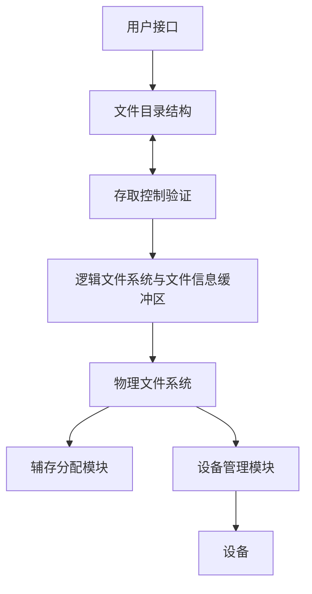

[TOC]


# 第一章——绪论


## 1.1 什么是操作系统

### (1) 为什么需要操作系统

用户几乎不可能使用裸机，计算机硬件只能识别0、1二值机器码，机器码直观性差，容易出错，难于交流，因此，通常在计算机硬件之上会覆盖一层软件，以方便用户使用计算机硬件。

如果在裸机之上覆盖一层I/O设备管理软件，就能使用户较方便地使用外部设备；如果在其上再覆盖一层文件管理软件，用户就很容易存取系统文件和用户文件；每覆盖一层新的**软件**，就构造了一台功能更强的虚拟机器。通过OS，计算机能提供种类更多，质量更高的服务。

### (2) 操作系统的概念

- **CPU是计算机硬件的核心**，是计算机系统的心脏。

- **操作系统则是计算机软件的核心**，是计算机系统的大脑。

- 操作系统是整个计算机系统的控制中心，是计算机系统中首要的、最重要的、最复杂的系统软件。

- 定义：<font color="red">**把操作系统定义为用以控制和管理计算机系统资源，方便用户使用的程序和数据结构的集合。**</font>

  

### (3) 计算机系统部件

计算机系统可以粗分为四个组件：硬件、操作系统、应用程序以及用户。

硬件包括：CPU、内存、输入输出设备、系统总线


操作系统是**硬件之上的第一层软件，是对硬件的首次扩充，又是其他软件运行的基础**

### (4) 操作系统的目标与作用

**目标**

:one: Execute user programs and make solving user problems easier.
**执行用户程序并使用户问题更易解决。**

:two: Make the computer system convenient to use.
**使计算机系统更易使用。**

:three: Use the computer hardware in an efficient manner.
**以一种有效率的方式使用硬件**。

**作用**

:one: **计算机硬件、软件资源的管理者**

:two: **用户使用计算机硬件、软件的接口**

:three: **操作系统是直接与硬件相邻的第一层软件，它是由大量极其复杂的系统程序和众多的数据结构集成的。**

> 对用户——接待员，对系统——管家婆

## 1.2 操作系统的发展

OS的发展和计算机硬件技术、体系结构相关

:one: 第一代 (1946年-1955年)： 真空管时代，无操作系统 

:two: 第二代 (1955年-1965年)： 晶体管时代，**批处理系统** 

:three: 第三代 (1965年-1980年)： 集成电路时代，**多道程序设计** 

:four: 第四代 (1980年 - 至今)： 大规模和超大规模集成电路时代，**分时系统**。

现代计算机正向着**巨型、微型、并行、分布、网络化和智能化**几个方面发展。

### (1) 手工操作

1946 ~ 50年代（真空管）、集中计算（计算中心）、 计算机资源昂贵、用户独占全机 

以ENIAC为代表

**工作方式：**人工操作方式，用户是计算机专业人员；

**编程语言：**机器语言；

**I/O：**纸带或卡片；（CPU与I/O速度不匹配的矛盾）

**缺点：**

- 用户独占全机，独占系统的全部硬件资源，设备利用率很低
- CPU等待用户：手工装入/卸取纸带或卡片

**提高效率的途径**：批处理**（一次处理一批任务）**、脱机I/O

**脱机I/O**：I/O工作在外围机/卫星机的控制下完成，或者说是在脱离主机的情况下进行。使用磁带作为输入/输出的中介，这种具体的输入/输出不需要在主计算机上进行的方式称“脱机输入/输出” 


### (2) 单道批处理系统(simple batch processing)

50年代末 ~ 60年代中（晶体管）、把一批作业以脱机输入方式输入到磁带/磁鼓、利用磁带或磁盘把任务分类编成作业顺序执行、每批作业由专门监督程序（Monitor）自动依次处理

**批处理系统解决了高速计算机的运算、处理能力与人工干预之间的速度矛盾，实现了作业自动过渡。**


**<mark>运行特征</mark>**

> **顺序性**：磁带上的各道作业是顺序地进入内存，各作业的完成顺序与他们进入内存的顺序相同
>
> **单道性**:内存中仅有一道程序运行
>
> **自动性**

**优点**：减少了CPU的空闲时间，提高了主机CPU和I/O设备的使用效率，提高了吞吐量

**缺点**：CPU和I/O设备使用忙闲不均

### (3) 多道批处理系统(Multiprogrammed Batch Systems)

60年代中 ~ 70年代中（集成电路）

**多道：**内存中同时存放几个作业，使之都处于执行的开始点和结束点之间，多个作业共享CPU、内存、外设等资源

**目的：**利用多道批处理提高资源的利用率

60年代通道和中断技术的出现解决了输入输出等待计算的问题

> **通道**:   是一种专用部件，负责外部设备与内存之间信息的传输。
> <mark>**中断**</mark>：指主机接到外界的信号（来自CPU外部或内部）时，立即中止原来的工作，转去处理这一外来事件，处理完后，主机又回到原来工作点继续工作。 


多道通过组织作业使得CPU总在执行其中一个作业，从而提高了CPU的利用率

**多道批处理系统所用技术**

> **作业调度**：作业的现场保存和恢复－－上下文切换
> **资源共享**：资源的竞争和同步－－互斥(exclusion)和同步(synchronization)机制；
> **内存使用**：提高内存使用效率（为当前由CPU执行的程序提供足够的内存）－－覆盖(overlap)，交换(swap)和虚拟存储(virtual memory)；
> **内存保护**:系统存储区和各应用程序存储区不可冲突；
> 文件非顺序存放、随机存取

<mark>运行特征</mark>

> **多道性**：内存中同时驻留多道程序并发执行，从而有效地提高了资源利用率和系统吞吐量
>
> **无序性**：作业的完成顺序与它进入内存的顺序之间无严格的对应关系
>
> **调度性**：作业调度、进程调度

**优点**：资源利用率高:CPU,内存,I/O设备；系统吞吐量大

**缺点**：无交互能力，用户响应时间长；作业平均周转时间长（有可能第一个进入，最后一个出）

### (4) 分时系统(time-sharing system)

70年代中期至今

**分时**是指多个用户分享使用同一台计算机。多个程序分时共享硬件和软件资源

> 多个用户分时
>
> 前台(正在跟系统交互)和后台程序(foreground & background)分时

通常按**时间片(time slice)**分配：各个程序在CPU上执行的轮换时间

作业直接进入内存、每个作业一次只运行很短的时间

**分时技术**：把CPU的时间分成若干个大小相等（或不等）的时间单位，称为时间片（如100毫秒），每个终端用户获得CPU（获得一个时间片）后开始运行，当时间片到，该用户程序暂停运行，等待下一次运行

**分时系统的特点**

> **多路性**：众多联机用户可以同时使用同一台计算机；
> **独占性**：各终端用户感觉到自己独占了计算机；
> **交互性**：用户与计算机之间可进行“会话”；
> **及时性**：用户的请求能在很短时间内获得响应。

### (5) 实时系统(Real-Time Systems)

**具有严格确定的时间限制的操作系统，对实时性要求很高，专用性强。**

分为硬实时系统与软实时系统。

实时系统与批处理系统和分时系统的**区别**

> 专用系统：许多实时系统是专用系统，而批处理与分时系统通常是通用系统。
>
> 实时控制：实时系统用于控制实时过程，要求对外部事件的迅速响应，具有较强的中断处理机构。
>
> 高可靠性：实时系统用于控制重要过程，要求高度可靠，具有较高冗余。如双机系统。
>
> 事件驱动和队列驱动：实时系统的工作方式：接受外部消息，分析消息，调用相应处理程序进行处理。
>
> 可与通用系统结合成通用实时系统：实时处理前台作业，批处理为后台作业。

### (6) 并行系统(Parallel Systems)

1975年前后，为了提高计算机系统性能和可靠性产生了**并行系统**（也称多处理机系统multi-processor) **:label:注意区分多处理器与多道**

并行系统：**有紧密通信的、多于一个CPU的多处理器系统**，属于紧耦合系统

包括对称多处理器系统与非对称处理器系统

**优点**：吞吐量大、经济、可靠

### (7) 分布式系统(Distributed Systems)

**计算分布在若干物理处理器上**,属于松散耦合系统

分布式系统具有一个统一的操作系统，它可以把一个大任务划分成很多可以并行执行的子任务，并按一定的策略将它们动态地分配给各个计算机执行，并控制管理各个计算机的资源分配、运行及计算机之间的通信，以协调任务的并行执行。

**优点**：资源共享、加快计算、可靠、可通信

### (8) 网络操作系统

网络操作系统是在通常操作系统功能的基础上**提供网络通信和网络服务功能**的操作系统。网络操作系统为网上计算机进行方便而有效的网络资源共享，提供网络用户所需各种服务的软件和相关规程的集合。

**分布式操作系统和网络操作系统的比较**

> :one: 耦合程度（从分布式任务管理和调度）：
>
> A. 分布式系统是紧密耦合系统：分布式OS是在各机上统一建立的“OS同质”，直接管理CPU、存储器和外设；统一进行全系统的管理；
>
> B. 网络通常容许异种OS互连，各机上各种服务程序需按不同网络协议“协议同质”。
>
> :two: 并行性：
>
> A. 分布式OS可以将一个进程分散在各机上并行执行“进程迁移”；
>
> B. 网络则各机上的进程独立。
>
> :three: 透明性：用户是否知道或指定资源在哪个机器上（如CPU、内存或外设）。
>
> A. 分布式系统的网络资源调度对用户透明，用户不了解所占有资源的位置；
>
> B. 网络操作系统中对网络资源的使用要由用户明确指定；
>
> :four: 健壮性：分布式系统要求更强的容错能力（工作时系统重构） 

### (9) 嵌入式系统

- **在各种设备、装置或系统中，完成特定功能的软硬件系统**
- 它们是一个大设备、装置或系统中的一部分，这个大设备、装置或系统可以不是“计算机”
- 通常工作在反应式或对处理时间有较严格要求环境中
- 由于它们被嵌入在各种设备、装置或系统中，因此称为嵌入式系统

## 1.3 操作系统的功能

### (1) 处理机管理

完成处理机资源分配和调度等功能

**进程控制**：创建、撤销、挂起、改变运行优先级等——主动改变进程的状态

**进程调度**:作业和进程的运行切换，以充分利用处理机资源和提高系统性能

**进程同步**：协调并发进程之间的推进步骤，以协调资源共享

**进程通信**:进程之间的信息交换

### (2) 存储器管理

目标：提高内存利用率、方便用户使用、提供足够的存储空间

功能：**存储分配与回收、存储保护、地址重定位、内存扩充**

### (3) 设备管理

**目标**：完成用户的I/O请求,为用户分配I/O设备、提高I/O速度，提高CPU与I/O设备利用率、方便设备使用

**功能**

> **缓冲管理**
>
> **设备分配与回收**
>
> **设备处理**:利用设备驱动程序（通常在内核中）完成对设备的操作。
>
> **虚拟设备**
>
> **设备独立性**:提供统一的I/O设备接口，使应用程序独立于物理设备

### (4) 文件管理

**目标**：实现外存上的信息资源“按名存取” 

**功能**

> **文件存储空间管理**:如何存放信息，以提高空间利用率
>
> **目录管理**:文件检索
>
> **文件存取控制**:文件保护
>
> **软件管理**:软件的版本、相互依赖关系、安装和拆除等

### (5) 用户接口

**目标**：为用户使用计算机系统提供一个友好的访问OS的接口

包括作业级接口与程序级接口(系统调用)

## 1.4 操作系统的特点

现代操作系统的特征有如下4个

### (1) 并发性(concurrency)

多个事件在**同一时间段**内发生。操作系统是一个并发系统，各进程间的并发，系统与应用间的并发。操作系统要完成这些并发过程的管理。并行(parallel)是指在**同一时刻**发生。

在多道程序处理时，宏观上并发，微观上交替执行（在单处理器情况下）。

程序的静态实体是可执行文件，而动态实体是进程（或称作任务），**并发指的是进程**。

### (2) 共享性(sharing)

多个进程共享有限的计算机系统资源。操作系统要对系统资源进行合理分配和使用。资源在一个时间段内交替被多个进程所用

共享方式有两种：互斥共享与同时访问

> **互斥共享**（如音频设备、打印机）：资源分配后到释放前，不能被其他进程所用。
>
> **同时访问**（如可重入代码，磁盘文件）

### (3) 虚拟性(virtual)

一个物理实体映射为若干个对应的逻辑实体——分时或分空间。虚拟是操作系统管理系统资源的重要手段，可提高资源利用率。

### (4) 异步性(asynchronism)

也称不确定性，指进程的执行顺序和执行时间的不确定性。进程的运行速度不可预知：分时系统中，多个进程并发执行，“时走时停”，不可预知每个进程的运行推进快慢

# 第二章 计算机系统结构


## 2.1 计算机系统操作


- I/O 设备与CPU可并行运行
- 每一设备控制器负责一个设备类型
- 每一设备控制器有一局部缓存
- CPU 通过局部缓存与主存交换数据
- I/O从设备到设备控制器的局部缓存
- 设备控制器通过引起<font color="red">*中断* </font>通知CPU操作已完成

### (1) 中断机制

中断能使系统更高效以及能提高系统的并发度，包括硬件中断与软件中断

:star: **硬件中断**：设备控制器利用中断通知CPU它已经完成了某个操作

:star: **软件中断**：也称为陷阱，包括异常(Exception)与系统调用(System call)

现代操作系统是中断驱动的，中断会将控制权转移到中断服务程序，有通用的程序检测是否有中断，对于不同的中断会有相应的代码来进行处理。

**中断向量表与中断向量**

> **中断向量是中断服务程序的入口地址。**
>
> 将所有中断向量集中放在一起，形成中断向量表。8086系统有256个类型的中断源。每个类型对应一个中断向量,一个中断向量由四个字节组成：2个高地址字节：存放中断服务程序的代码段的段值；2个低地址字节：存放中断服务程序的偏移地址。中断向量表放在内存的低段地址0单元开始的单元:00000H~03FFFH。


### (2) I/O中断

两种I/O操作：同步与异步

> Synchronous同步：当I/O操作开始时，系统会等待I/O操作结束才执行其他的操作
>
> Asynchronous异步：当I/O操作开始时，系统不会等待，而是直接去执行其他的操作

I/O操作结束后，会触发一个中断通知系统


基于中断的方法:

> **设备状态表：**包含每个I/O设备的条目，其中包括设备类型、地址和状态
>
> 每个I/O设备的**等待队列(**等待请求的列表)

### (3) DMA操作

对于高速设备，用直接内存访问(Direct Memory Access)，设备控制器在本地缓冲和内存之间直接传输一整块数据而无需CPU干预，降低中断的频率。

## 2.2 存储结构

**Speed 速度**

**cost 成本**

**volatility 易失性**：断电以后数据会消失，如内存易失，硬盘不易失


### (1) Main Memory

包括随机存取存储器(RAM)，是CPU可以直接访问的唯一大型存储介质（**CPU可以直接访问寄存器，cache与主存**）

存储属于与指令

**缺点：**存储空间不够大以及具有易失性

### (2) Secondary Storage

二级存储，指的主要是磁盘，是主存的扩展

磁盘是覆盖了磁记录材料的硬金属或玻璃盘片

### (3) Cache

缓存，暂时保存最近访问的数据，访问速度很快。

命中率：CPU先访问cache，没有相应的数据才去访主存

> 没有cache的访问时间是100ms，有cache的访问时间为20ms，命中率为80%，平均需要：（100+20)x0.2+20x0.8=40ms，注意都要加上cache的访问时间

**缺点：**cache的使用会造成数据的不一致，在多道程序、多处理机、分布式下

## 2.3 硬件保护

多用户环境，需要保护磁盘上的文件、数据

### (1) Dual-Mode Operation 两状态操作

:one: *User mode* – execution done on behalf of a user.**用户态**-代表用户执行

:two: *Monitor mode* (also *supervisor mode* or *system mode*) – execution done on behalf of operating system.  **管态**（特权模式或系统模式）-代表操作系统执行

模式位(mode bit)添加到计算机硬件，表示当前模式

系统引导时，硬件处于管态，在用户模式下执行用户进程；**一开机的时候处于管态，要执行用户程序的时候转换为用户态；当出现中断或者陷阱时，硬件会切换到管态**


系统怎么知道要转换为管态？——**引入特权指令**

**特权指令：只能在管态下运行的指令，通常使用系统调用。**

> 在用户态下，需要转换模态才能使用
>
> 在管态下直接使用即可

:star: 特权指令: **设置定时器的值、清除内存、关闭中断**

非特权指令：**读时钟、从用户态切换为管态**

### (2) I/O Protection 

**所有的I/O操作都是特权指令，用户不能直接进行I/O操作，必须通过系统调用**

 


   要保护I/O操作，需要保护中断向量表与中断向量，由于它们时存储在内存中的

   所以必须进行内存保护


### (3) Memory Protection 内存保护

确定进程能访问的合法空间，使用基址寄存器与界限寄存器，即内存的开始地址与长度


基本寄存器和限制寄存器只能由操作系统通过使用特殊的**特权指令**加载，即只能在管态下进行

在监视器模式下执行时，操作系统对监视器和用户的内存都有无限制的访问

### (4) CPU Protection

防止用户程序陷入死循环或者不调用系统服务且不将控制权返回到OS——设置定时器(Timer)

定时器：设置定时器产生中断，当定时器到时间了会产生中断，控制权会返回给OS，可以用来实现分时系统

# 第三章 操作系统结构


## 3.1 Operating System Services操作系统服务

操作系统提供的服务如下：

> - **用户界面：包括命令行界面与图形化界面**
> - **程序执行**
> - **I/O操作**
> - **文件系统操作**
> - **通信：两种方式：共享内存与消息交换(进程部分会细讲)**
> - **错误检测**

其他的功能不是用于帮助用户，而是为了系统效率：

- Resource allocation 资源分配 ：把资源分配给多个用户或多个同时运行的作业
- Accounting帐务：跟踪和记录用户对资源的使用，用于帐单和统计
- Protection 保护：确保对资源的所有访问均在控制中


## 3.2 System Calls系统调用

### 1、系统调用的概念

**系统调用提供在运行程序和操作系统之间的接口，属于一个软中断**

通常以汇编语言指令形式提供；替代汇编语言的、供系统编程的语言，允许直接使用系统调用

主要由程序通过**高级应用程序接口(API)**访问，而不是直接系统调用使用

三个最常见的API

> Windows的Win32 API
>
> POSIX API用于基于POSIX的系统(包括几乎所有版本的UNIX、Linux和Mac OS X)
>
> 用于Java虚拟机(JVM)的Java API

系统调用的处理机构:陷入（TRAP）或异常处理机构

把由于系统调用引起处理机中断的指令称为**陷入或异常指令（或称访管指令）**

### 2、系统调用的过程

:one: 当用户使用系统调用时，产生一条相应的指令

:two: CPU在执行到该指令时发生中断，发出有关的信号给陷入处理机构；

:three: 在处理系统调用之前，陷入处理机构还需**保存处理机现场**（PSW、PC、系统调用号、用户栈指针、通用寄存器、用户定义的参数等）

:four: 处理机构在收到了CPU发来的信号后，启动相关的处理程序去完成该系统调用所要求的功能

:five: 如何找到实现系统调用功能的子程序:**入口地址表**，每个入口地址与相应的系统程序对应

:six: 陷入处理程序用系统调用功能号查找入口地址表,得到该系统程序的入口地址,并执行之

:seven: 系统调用处理结束后，要恢复处理机现场，从而用户程序可以继续执行


### 3、向操作系统传递参数的常见方式

  3种常用方式用于在运行程序和操作系统之间的参数传递：

:one: Pass parameters in *registers*寄存器中的参数传递

:two: 参数存在内存的一张表中，表地址作为寄存器的参数传递

此时，这些参数存在内存的块或者表中，而块和表中的地址通过寄存器来传递


:three: 程序把参数压入栈，由操作系统弹出

### 4、系统调用的类型

六大类：进程控制、文件管理、设备管理、信息维护、通信、保护 

## 3.3 System Programs系统程序

**系统程序提供程序开发和执行的便利环境**。可划分为：

> 文件操作、状态信息、文件修改、程序语言支持、程序调入与执行、通信、应用程序

大多数用户看到的操作系统是由系统程序定义而不是实际的系统调用定义的

## 3.4 System Components系统部件

Process Management 进程管理

Main Memory Management主存管理

Secondary-Storage Management 二级储存器管理

I/O System Management I/O系统管理

File Management 文件管理

Protection System 保护系统

Networking 网络处理

Command-Interpreter System 命令解释器系统

## 3.5 System Structure 系统结构

### 1、简单结构Simple Approach 

**MS-DOS**

MS-DOS 以最小的空间提供最多的功能

> 不划分模块
>
> 尽管有某种结构，其接口与功能层没有划分清楚

应用程序可直接访问BIOS例程，来直接操纵设备，当然这受限于当时的硬件，intel8088没提供双模式和硬件保护，这使得DOS别无选择只能任由应用程序访问BIOS.


**UNIX**

受硬件功能限制，早期UNIX只是有限的结构化。 UNIX包括2个分离的部分:系统程序与内核

内核包括了在物理硬件之上，系统调用之下的一切，提供文件系统、CPU调度、存储管理和其他操作系统功能：每一层有大量的功能


### 2、层次化结构Layer Structure

分层法：操作系统划分为若干层，在低层上构建高层。底层（0层）为硬件；最高层（ N层）为用户层

**分层的基本原则**

> 每一层都使用其底层所提供的功能和服务，以便于系统调试和验证。

**困难**

> 层次的划分和安排，要保证不出现双向依赖关系


**优点**(<font color="red">重点</font>)

> :one: 低层和高层可分别实现（便于扩充）；
>
> :two: 高层错误不会影响到低层，便于调试、利于功能的增删改；
>
> :three: 调用关系清晰（高层对低层单向依赖），避免递归调用，有利于保证设计和实现的正确性 

**缺点**

> 系统中所有进程的控制转移、通讯等任务全部交给系统的核心去管理，要花费一定的代价

### 3、微内核Microkernels

**Mach 首先使用微内核结构，**典型系统如MACH和Windows NT

通过划分系统程序和用户程序，把所有不必要的部件移出内核，形成一个小内核，微内核提供最少量的进程管理、存储管理，以及通信功能

操作系统由**两大部分**组成

> 运行在核心态的内核
> 运行在用户态并以C/S方式运行的进程层

基于微内核结构的OS和传统OS相比，具有以下特点：

:one: **内核精巧**．通常内核只由<font color="red">任务管理、虚存管理和进程间通信3个部分</font>组成．传统OS内核中的许多部分都被移出内核．采取服务器方式实现；

:two: **面向多处理机和分布式系统**．基于微内核的OS，在内核中引入了多处理机调度和管理机制，并引入了细粒度并发机制——线程，使得多个处理机可以在同一个任务中并行地执行；

:three:  **基于客户／服务器体系结构**．在微内核结构的OS中，任务间通信机制—— 消息机制是系统的基础，OS的各种功能都以服务器方式实现，向用户提供服务．用户对服务器的请求是以消息传递的方式传给服务器的．

<font color="red">优点</font>

> 易于扩充，易于移植
> 提高系统的可靠性：
> 提供多种操作环境
> 便于实现分布计算：以同样的调用形式，在下层可通过核心中的网络传送到远方服务器上  (RPC, Remote Procedure Call)

<font color="red">缺点</font>

> 消息传递方式增加开销，使响应变慢

### 4、模块

**可加载的内核模块**

> 使用面向对象的方法 
>
> 每个核心组件都是分开的
>
> 每个都通过已知的界面与其他人联系
>
> 每个都可根据需要在内核内加载

内核提供核心服务，其他服务在内核运行时可动态加载，类似于分层，但是更加灵活，任何模块可以彼此调用，也类似于微内核，主模块只有核心功能，并知道如何加载其他模块和如何让模块进行通信

### 5、混合系统

大多数现代操作系统都不是单纯的一个结构，而是会采用多种结构

## 3.6 Virtual Machines虚拟机

**虚拟机是层次化的逻辑结果**。它把硬件和操作系统看成都是硬件，虚拟机为裸机提供了统一的接口，操作系统创建了多个进程，每一个进程有自己的处理器和（虚拟）内存

**实现方式**：分时，共享

**物理计算机的资源被共享，以创建虚拟机**

> CPU调度使得用户好像有自己的处理器
>
> Spooling（外部设备练级并行操作）和文件系统提供了虚拟卡片阅读机和打印机
>
> 普通用户终端成为虚拟机操作员的控制台

**优缺点**

> 虚拟机概念提供对**系统资源的完全保护**，因为每个虚拟机同其他虚拟机隔离。当然，隔离不允许直接共享资源
>
> 虚拟机是**研发操作系统的完美载体**。系统开发在虚拟机上而不是在物理硬件上完成，从而不会打扰正常系统运行
>
> 由于需要对下面的机器进行精确的复制，所以虚拟机的**概念实现困难**

## 3.7 系统设计目标

用户目标 ：操作系统应该便于使用，易学，可靠，安全并且快捷

系统目标 ：操作系统应该容易设计、实现和维护，还要灵活、可靠、无错误和高效

# 第四章 进程


## 4.1 进程概念

**进程**：在批处理系统中指的是作业，在分时系统中指的是用户程序或者任务，在本篇文章中，使用的名词作业和进程，基本可互换

近代操作系统多为**并发执行**，具有许多新的特征，引入并发执行的目的是为了**提高资源利用率**

### 1、顺序与并发

**顺序环境**

顺序环境计算机系统只有一个程序在运行，该程序独占系统中所有资源，其执行不受外界影响

**顺序执行的特点**

> **顺序性**：按照程序结构所指定的次序（可能有分支或循环）
>
> **封闭性**：独占全部资源，计算机的状态只由于该程序的控制逻辑所决定
>
> **可再现性**：初始条件相同则结果相同。如：可通过空指令控制时间关系。

**并发环境**

一定时间内，物理机器上有两个或两个以上的程序同处于开始运行但尚未结束的状态，并且**次序不是事先确定的**。

**并发执行**

> **间断(异步)性**："走走停停"，一个程序可能走到中途停下来，失去原有的时序关系；
>
> **失去封闭性**：共享资源，受其他程序的控制逻辑的影响。如：一个程序写到存储器中的数据可能被另一个程序修改，失去原有的不变特征。
>
> **失去可再现性**：失去封闭性 －>失去可再现性；外界环境在程序的两次执行期间发生变化，失去原有的可重复特征

**顺序与并发总结**

> 顺序:上一个开始执行的任务完成后，当前任务才能开始执行
>
> 并发:无论上一个开始执行的任务是否完成，当前任务都可以开始执行
>
> (也就是说，AB顺序执行的话，A一定会比B先完成，而并发执行则不一定。)

**串行与并行总结**

> 串行:有一个任务执行单元，从物理上就只能一个任务、一个任务地执行
>
> 并行:有多个任务执行单元，从物理上就可以多个任务─起执行

并发的关键是你有处理多个任务的能力，不一定要同时。

并行的关键是你有同时处理多个任务的能力。

### 2、进程与程序

:one: **进程是动态的，程序是静态的**：程序是有序代码的集合；进程是程序的执行。通常进程不可在计算机之间迁移；而程序通常对应着文件、静态和可以复制。

:two: **进程是暂时的，程序是永久的**：进程是一个状态变化的过程，程序可长久保存。

:three: **进程与程序的组成不同**：进程的组成包括程序、数据和**进程控制块**（即进程状态信息）。

:four: **进程与程序的对应关系**：通过多次执行，一个程序可对应多个进程；通过调用关系，一个进程可包括多个程序

### 3、进程的特征

**结构特征**：`进程实体=程序段+相关的数据段+PCB`

**动态性**：进程的实质是进程实体的一次执行过程，因此**动态性是进程的最基本的特征。**

**并发性**: 多个进程实体同存在于内存中，且能在一段时间内同时运行。是最重要的特征。

**独立性**：指进程实体是一个能独立运行、独立分配资源和独立接受调度的基本单位。

**异步性**: 进程按各自独立的、不可预知的速度向前推进。

### 4、进程的类型

系统中主要有两大类进程

> 1、系统进程：系统进程能管理和控制资源
>
> 2、用户进程：执行用户程序的进程

**区别**

> :one: 资源的使用：系统进程被分配一个**初始的资源集合**，这些资源可以为它独占，也能以最高优先权的资格使用。用户进程通过**系统服务请求**的手段竞争使用系统资源；
>
> :two: I/O操作：用户进程不能直接做I/O操作，而系统进程可以做显式的、直接的I/O操作。
>
> :three: CPU工作状态：系统进程在**管态**下活动，而用户进程则在**用户态**（目态）下活动。

### 5、进程状态

进程在执行的时候会改变状态，每个进程可能处于以下几个状态：

:hourglass_flowing_sand: <mark>**五状态模型**</mark>

> **新建new**：在创建进程
>
> > OS 已完成为创建一进程所必要的工作
> >
> > > 已构造了进程标识符;
> > > 已创建了管理进程所需的表格;
> >
> > 还没有允许执行该进程：因为资源有限
>
> **就绪ready**：进程等待分配处理器,**已经获得了除处理器以外的所有资源**
>
> > 存在于处理机调度队列中的那些进程，它们已经准备就绪，一旦得到CPU，就立即可以运行（有多个进程处于此状态）
> >
> > 时间片用完处于就绪状态
>
> **运行running**：指令在执行
>
> > 当进程由调度/分派程序分派后，得到CPU控制权，它的程序正在运行（在系统中，总只有**一个进程**处于此状态）
>
> **(阻塞)等待waiting**：进程等待某些事件发生
>
> > 进程正在等待某个事件的发生（如等待I/O的完成），而暂停执行
> >
> > 即使给它CPU时间，它也无法执行
>
> **终止terminated**：进程执行完毕

:label:注意区分就绪状态和阻塞状态：关键在于分配给该进程处理器时，能否立即执行，能的话处于就绪状态；否则处理阻塞状态。
而且执行状态只能由就绪状态转换，而无法从阻塞状态直接转换


> 状态转换
>
> 就绪状态-->执行状态：一个进程被进程调度程序选中
>
> 执行状态-->阻塞状态：请求并等待某个事件发生
>
> 执行状态-->就绪状态：时间片用完或在抢占式调度中有更高优先级的进程变为就绪状态
>
> 阻塞状态-->就绪状态：进程因为等待的某个条件发生而被唤醒

:hourglass_flowing_sand: **七状态模型**

引入了挂起:

:one: **终端用户的需要**：当终端用户在自己的程序运行期间，发现有可疑问题时，往往希望暂时使自己的进程静止下来,以便研究其执行情况或对程序进行修改;

:two: **父进程的需要**：父进程常常希望考察和修改子进程，或者需协调各子进程间的活动，要挂起自己的子进程;  

:three: **操作系统的需要**：操作系统有时需要挂起某些进程，检查运行中资源的使用情况及进行记帐，以便改善系统的运行性能。

:four: **对换的需要**：为了缓和内存紧张的情况，将内存中处于阻塞状态的进程换至外存上。

:five: **负荷调节的需要**：当实时系统中的工作负荷较重，可能影响到对实时任务的控制时，可由系统把一些不重要或不紧迫的进程挂起，以保证系统仍然能正常运行。


### 6、进程控制块(PCB)

PCB (Process Control Block):一个专门的数据结构，系统用它来记录进程的外部特征，**描述进程的运动变化过程** 

PCB是进程管理和控制的最重要的数据结构，在创建进程时，建立PCB，并**伴随进程运行的全过程**，直到进程撤消而撤消。

PCB是系统感知进程存在的唯一标志,**进程与PCB是一一对应的**

PCB经常被系统访问，如，调度程序、资源分配程序、中断处理程序等，所以PCB应**常驻内存**。

包含以下信息：

> 进程状态、程序计数器、CPU寄存器、CPU调度信息、内存管理信息、计账信息、I/O状态信息
>
> 

为了管理的方便，系统将相同状态的进程组成一个队列，如就绪进程队列，等待进程则要根据等待的事件组成多个等待队列，如等待打印机队列、等待磁盘I/O完成队列等等。

当前队列指针 next:登记与本进程处于同一队列的下一个进程的PCB的地址


PCB通过表来进行组织，PCB表的个数就决定了系统中最多可同时存在的进程个数，成为**系统的并发度**。组织方式包括：**链接方式与索引方式**


## 4.2 进程调度

多道程序设计的目的是无论何时都有进程进行，可以最大化CPU利用率；分时系统的目的是在进程之间快速切换CPU，以便用户在程序运行时能与其交互。为了这些目的，**进程调度器**选择一个可用进程到CPU中进行

### 1、调度队列

**作业队列** - 在系统中的所有进程的集合

**就绪队列** - 在主内存中的，就绪并等待执行的所有进程的集合

**设备队列** - 等待某一I/O设备的进程队列


### 2、调度程序

调度分为三种：长程调度、中程调度与短程调度

**长程调度（或作业调度）**- 选择可以进入就绪队列的进程(从外存进内存)

> 速度较慢
>
> 长程调度控制了多道程序的“道”

**短程调度（或CPU调度）**- 选择可被下一个执行并分配CPU的进程

> 速度较快，切换频率高

**中程调度**-为了缓和内存紧张的情况，将内存中处于阻塞状态的进程换至外存上（挂起），降低多道程序的度。当这些进程重新具备运行条件时，再从外存上调入内存。这一方案称为**交换**


### 3、上下文切换

当CPU切换至另一个进程时，系统必须保存旧进程状态并为新进程调入所保留的状态，上下文切换的时间开销较重；在切换时，系统没有做有用的工作，  时间取决于硬件的支持 

<font color="red">**具体的操作**</font>

> 当发生上下文切换时，内核CPU会将旧进程的上下文保存在PCB中，并加载计划进行的新进程的上下文

## 4.3 进程上的操作


### 1、进程创建process creation

进程何时创建？

> **作业调度**：批处理系统中，**作业调度程序**调度到某个作业以后，就把这个作业装入内存，并分配必要的资源,创建进程，插入就绪队列。
>
> **用户登录**：在分时系统中，用户在终端键入**登录命**令后，若是合法用户，系统建立一个进程，并插入就绪队列。

父进程创建子进程，如此轮流创建下去，构成一个进程树

**资源共享**

> 三种方式
>
> 1、父进程子进程共享所有的资源
>
> 2、子进程共享父进程资源的子集
>
> 3、父子进程无共享

当进程**创建**新进程时，可能有两种执行可能：

> 父进程与子进程并发执行
>
> 父进程等待，直到子进程终止

新进程的**地址空间**也有两种可能

> 子进程是父进程的复制品，具有和父进程一样的程序和数据
>
> 子进程加载另一个新程序

#### 进程创建的过程

:one: **申请空白的PCB**：为新进程分配唯一的**数字标识符**，并从PCB集合中索取一个空白的PCB。

:two: **为新建立的进程分配资源**：为新进程的程序和数据，以及用户栈分配必要的内存空间

:three: **初始化程序控制块**

> 初始化标识符信息。将系统中分配的标识符、父进程标识符填入新PCB中。
>
> 初始化处理机状态信息。是程序计数器指向程序的入口地址，栈指针指向栈顶。
>
> 初始化处理机控制信息。将进程的状态设置为就绪状态或静止就绪状态。

:four: **将新进程插入就绪队列**。

#### UNIX例子

fork()：系统调用创建新进程

execlp()：系统调用用一个新程序替代进程的内存空间

```c
#include<stdio.h>
#include<unistd.h>
void main(int argc, char *argv[])
{ int pid;
    pid = fork(); /*fork another process*/
    if (pid < 0) {/* error occurred */
        fprintf(stderr, “Fork Failed”); 
        exit(-1); }
    else if (pid == 0) { /* child process */
        execlp(“/bin/ls”,”ls”,NULL);
     }  else {   /* parent process */   
         wait(NULL);
         printf(“Child Complete”);
         exit(0);
      }
} 
```

> pid=fork()： 从系统调用fork返回时，CPU在父进程中时，pid值为所创建子进程的进程号大于0，若在子进程中时，pid的值为零。

### 2、进程终止process termination

**进程调用**：当进程完成执行最后语句并且通过系统调用exit()请求操作系统删除自身时，进程终止。此时，进程可以返回状态值(通常为整数)到父进程(通过系统调用exit())。所有进程资源会被系统释放

父进程可终止子进程的执行

> 子进程使用了超过它所分配的资源
>
> 赋予子进程的任务不再需要
>
> 父进程终止

**僵尸进程**：当进程已经终止，但是其父进程尚未调用wait()

**孤儿进程**：父进程没有调用wait()就终止，其子进程成为孤儿进程

### 3、进程阻塞process blocking

引起进程阻塞和唤醒的事件：

>  一个处在运行状态的进程，因等待某个事件的发生（如等待打印机、同步事件等）而不能继续运行时，将调用阻塞原语，把进程置为阻塞状态，并转进程调度程序（等于让出处理机）。

调用进程阻塞操作是在进程处于**运行状态**下执行的。它的执行将引起等待某事件的队列的改变


### 4、进程唤醒

当进程所等待的事件发生时，该进程将被唤醒(由进程唤醒操作完成)。

唤醒一个进程有两种方法：由系统进程唤醒、由事件发生进程唤醒


## 4.4 协同进程Cooperating Processes

独立进程不会影响另一个进程的执行或被另一个进程执行影响

协同进程可能影响另一个进程的执行或被另一个进程执行影响

进程协同的优点

> Information sharing 信息共享
> Computation speed-up 加速运算
> Modularity 模块化
> Convenience 方便

## 4.5 进程间通信Interprocess Communication (IPC)

通常有两种方式：共享内存与消息传递


### 1、共享存储

使用共享存储模型的进程间通信要建立共享存储区，进程通过读写共享存储区来交换信息，由通信进程来确定交换的数据和位置，**不受操作系统的控制**

### 2、消息传递

若P与Q需要通信，需要建立通信连接与通过send/receive交换信息。

通信连接的实现有**物理的**：如共享存储和硬件总线；有**逻辑的**：如逻辑特性

消息传递有两种方式：**直接通信与间接通信**

#### 直接通信

进程必须显式的命名

> send(P,message)：向进程P发信息
>
> receive(Q,message)：从进程Q收消息

#### 间接通信

消息导向至信箱并从信箱接收（被视作端口port）

每一个信箱有一个唯一的id；仅当共享一个信箱时进程才能通信

> Primitives are defined as:
>
> ​    send(A, message) – send a message to mailbox A
>
> ​    receive(A, message) – receive a message from mailbox A
>
> mailbox A

进程创建的邮箱是私有的，操作系统创建的邮箱是共享的

**操作**

>  创建新的信箱
>
>  通过信箱发送和接收消息
>
>  销毁信箱

邮箱共享时谁得到信息？

解决方案：允许一个连接最多同2个进程相关只允许一个时刻有一个进程执行接受操作；允许系统任意选择接收者。发送者被通知谁是接收者

### 3、同步Synchronization

消息传递要么是阻塞的，要么是非阻塞的。

> **阻塞的消息传递是同步的**，发送者会等待消息被接收，接收者会等待消息到达可用
>
> **非阻塞的消息传递就是异步的**发送者会一直发送消息不必等待，接收者同样也可以不必等待

### 4、缓冲Buffering

不管通信时直接的还是间接的，通信进程交换的信息总是驻留在临时队列中。队列实现有三个方法：

> **零容忍**：发送者必须等待接收者
>
> **有限容量**：n个消有限长度，若连接满了发送者必须等待
>
> **无限容量**：无限长度，发送者从不等待

### 5、消息传递的例子

#### Match

即使是系统调用也是通过消息传递实现的

在创建一个任务时也创建了两个特殊邮箱：内核邮箱kernel mailbox与通知邮箱notify mailbox。内核通过内核邮箱与任务通信，将事件发生的通知发送到通知邮箱。

消息传递只需要三个系统调用：`msg_send(), msg_receive(), msg_rpc()//远程调用`

系统调用port_allocate()创建新邮箱，并为消息队列分配空间，最大长度位8个消息

#### Windows XP

XP 使用两种消息传递技术：

1，对于少量信息：使用端口的消息队列，消息的最大长度为256字节，简单。

2，对于大量信息：使用section object,即建立一块共享内存。

# 第五章 线程


## 线程的引入

进程具有二个**基本属性**：

> :one: 是**一个拥有资源的独立单位**:它可独立分配虚地址空间、主存和其它
> :two: 又是一个可独立调度和分派的基本单位。

这二个基本属性使进程成为**并发执行的基本单位**

在一些早期的OS中，比如大多数UNIX系统、Linux等，进程同时具有这二个属性。

**由于进程是一个资源的拥有者，因而在进程创建、撤销、调度切换时，系统需要付出较大的时空开销。进程的数目不宜过多，进程切换频率不宜过高，限制了并发程度。**

**操作系统的设计目标**：提高并发度；减小系统开销

将进程的两个基本属性分开，对于**拥有资源的基本单位**，不对其进行频繁切换，对于**调度的基本单位**，不作为拥有资源的单位，“轻装上阵”

引入线程的目的是**简化线程间的通信，以小的开销来提高进程内的并发程度**。

**实例：**

在有些情况下,一个应用程序可能需要执行多个不同的任务,从而完成一个整体的任务。

> 例如：一个字处理程序(如word)可能同时有一个线程接收用户输入，另外一个线程显示图形，还有一个线程执行拼写检查。

在某些情况下，一个应用程序可能需要执行多个相似任务。

> 如网页服务器，可能有多个客户端并发访问，如果网页服务器作为传统进程来执行，那么一次只能对一个客户服务，客户的等待时间会很长

**解决方案1**

> 创建多个进程
> 网页服务器作为单个进程运行只接收请求
> 当接收到请求后，该进程创建另一个进程以处理请求

**解决方案2**

> 引入线程，多线程的进程
> 进程中的一个线程监听客户请求
> 当有请求时，该进程创建一个线程以处理请求


## 线程的概念

**进程**：资源分配单位（存储器、文件）和CPU调度（分派）单位。又称为"任务(task)"

**线程**：作为CPU调度单位，而进程只作为其他资源分配单位。也称为轻型进程

> 只拥有必不可少的资源，如：<font color="red">**线程状态、程序计数器、寄存器上下文和栈**</font>
> 同样具有**就绪、阻塞和执行**三种基本状态
> 与同属一个进程的其它线程共享进程拥有的全部资源
> 可并发执行

线程的优点：**减小并发执行的时间和空间开销（线程的创建、退出和调度），因此容许在系统中建立更多的线程来提高并发程度。**

> 线程的创建时间比进程短；
> 线程的终止时间比进程短；
> 同进程内的线程切换时间比进程短；
> 由于同进程内线程间共享内存和文件资源，可直接进行不通过内核的通信；


一个线程和他的对等线程**共享代码段、数据段和操作系统资源**，线程切换时**只需要切换寄存器和栈**，所以会比进程切换快

## 进程与线程的比较

**并发性：**在引入线程的OS中，不仅进程之间可以并发执行，而且在一个进程中的多个线程之间亦可并发执行，因而使OS具有更好的并发性，从而能更**有效地使用系统资源和提高系统吞吐量。**

**拥有资源**：进程是拥有资源的独立单位

**系统开销**：在创建或撤消进程时，系统都要为之分配或回收资源，如内存空间、I/O设备等。因此，OS所付出的开销将明显地大于在创建或撤消线程时的开销。 

**地址空间和其他资源（如打开文件）**：进程间相互独立，同一进程的各线程间共享——某进程内的线程在其他进程不可见

**通信**：进程间通信IPC，线程间可以直接读写进程数据段（如全局变量）来进行通信——需要进程同步和互斥手段的辅助，以保证数据的一致性

**调度**：线程上下文切换比进程上下文切换要快得多；


## 线程的好处

**响应度高**：一个多线程的应用在执行中，即使其中的某个线程阻塞，其他的线程还可继续执行，从而提高响应速度

**资源共享**：同一进程的多个线程共享该进程的内存等资源

**经济性**：创建和切换线程的开销要低于进程。比如，Solaris中进程创建时间是线程创建的30倍，进程切换时间是线程切换的5倍。

**MP体系结构的运用**：多线程更适用于多处理机结构。


## 内核线程与用户线程

**线程的两大类**：内核级的线程与用户级线程(操作系统无法感知，在用户空间)

### 内核线程

**内核级线程才真正是CPU调度的基本单位**

依赖于OS核心，由内核的内部需求进行创建和撤销，用来执行一个指定的函数。Windows NT和OS/2支持内核线程；

> 内核维护进程和线程的上下文信息；
>
> 线程切换由内核完成；
>
> 一个线程发起系统调用而阻塞，不会影响其他线程的运行。
>
> <font color="red">时间片分配给线程</font>，所以多线程的进程获得更多CPU时间。

### 用户线程

由用户级线程库进行管理的线程，线程库提供对线程创建和管理的支持，无需内核支持，**此时进程才是CPU调度的基本单位**

> 用户线程的维护由应用进程完成；
>
> 内核不了解用户线程的存在；
>
> 用户线程切换不需要内核特权；
>
> 用户线程调度算法可针对应用优化；

**缺点**:

如果内核是单线程的,那么一个用户线程发起系统调用而阻塞，则整个进程阻塞。

<font color="red">时间片分配给进程</font>，多线程则每个线程就慢。

### 内核线程与用户线程的比较

**调度方式**：内核线程的调度和切换与进程的调度和切换十分相似，用户线程的调度不需OS的支持。

**调度单位**：用户线程的调度以进程为单位进行，在采用时间片轮转调度算法时，每个进程分配相同的时间片。对内核级线程，每个线程分配时间片。

## 多线程模型

多对一、一对一、多对多

**多对一**

> 多个用户级线程映射到单个内核线程
>
> 用于不支持内核线程的系统中
>
> 任意时刻只能有一个线程可以访问内核(并发度低)
>
> 一个用户线程发起系统调用而阻塞，则整个进程阻塞


**一对一**

> 每个用户级线程映像进内核线程
>
> 提供了更好的并发性,一个用户线程发起系统调用而阻塞时允许另一个线程运行
>
> 每创建一个用户级线程需创建一个相应的内核线程,带来了额外开销,所以许多系统限制应用中的线程数目


**多对多**

> 多对一模型的缺点：不能实现真正的并发
> 一对一模型的缺点：需限制应用中的线程数目
> 多对多模型：不限制应用的线程数、多个线程可以并发


## 线程的取消

**异步取消**：一个线程立即终止目标线程

**延迟取消**：目标线程检查他是否应该终止，检查取消点

## 信号的发送

当特定事件发生时，一般会给进程发送信号来通知

信号可以被同步或异步的接收

同步信号会发送到产生信号的同一个进程。比如，非法内存访问，或者除零错。

当信号是由运行进程之外的事件所产生 ，那么进程就异步的接收信号。比如，定时器中断或者ctrl+C。

## 线程池

创建线程池的目的：避免创建和撤销开销；限制线程的数量

## 线程举例

### **SUN Soloris 2** 

Solaris支持内核线程(Kernel threads)、轻权进程(Lightweight Processes)和用户线程(User Level Threads)。一个进程可有大量用户线程；大量用户线程复用少量的轻权进程，不同的轻权进程分别对应不同的内核线程。

用户级线程在使用系统调用时（如文件读写），需要“捆绑(bound)”在一个LWP上。
永久捆绑：一个LWP固定被一个用户级线程占用，该LWP移到LWP池之外
临时捆绑：从LWP池中临时分配一个未被占用的LWP
对于没有绑定的LWP，则由线程库动态地进行调整：
一个进程对应的LWP组成LWP池，线程库动态调整池中LWP的数目，以保证应用的最佳性能：
当池中的LWP全部阻塞，而进程中还有线程可以运行，则线程库会为之创建另一个LWP；
当一个LWP长时间没用（老化，一般为5分钟），则线程库会删除它。

### **Windows NT**


**就绪状态(Ready)**：进程已获得除处理机外的所需资源，等待执行。
**备用状态(Standby**)：特定处理器的执行对象，系统中每个处理器上只能有一个处于备用状态的线程。
**运行状态(Running)**：完成描述表切换，线程进入运行状态，直到内核抢先、时间片用完、线程终止或进行等待状态。
**等待状态(Waiting)**：线程等待对象句柄，以同步它的执行。等待结束时，根据优先级进入运行、就绪状态。
**转换状态(Transition)**：线程在准备执行而其内核堆栈处于外存时，线程进入转换状态；当其内核堆栈调回内存，线程进入就绪状态。
**终止状态(Terminated)**：线程执行完就进入终止状态；如执行体有一指向线程对象的指针，可将线程对象重新初始化，并再次使用。
**初始化状态(Initialized)：**线程创建过程中的线程状态；

**有关API**

CreateThread()函数在调用进程的地址空间上创建一个线程，以执行指定的函数；返回值为所创建线程的句柄。
ExitThread()函数用于结束本线程。
SuspendThread()函数用于挂起指定的线程。
ResumeThread()函数递减指定线程的挂起计数，挂起计数为0时，线程恢复执行

### 线程库

线程库为程序员提供了创建和管理线程的API

有用户级线程库和内核级线程库

**举例**

> POSIX Pthreads  用户级线程库
> Win32 threads  支持内核线程
> Java thread

# 第六章 CPU调度


**高级(Long-term)调度——作业调度**

> 决定把外存输入井上处于作业后备队列上的哪些作业调入内存，并为它们创建进程、分配必要的资源，然后再将新创建的进程排在就绪队列上，准备执行。

**低级(Short-term)调度——进程调度**

> 决定就绪队列中哪个进程将获得处理机，然后由分派程序执行把处理机分配给该进程的操作。

**中级(Medium-term)调度——对换**


## 一、Basic Concepts  (基本概念）

通过多道程序设计**得到CPU的最高利用率**

CPU脉冲的分布,在系统中,存在许多短CPU脉冲,只有少量的长CPU脉冲

> 比如:I/O型作业具有许多短CPU脉冲,而CPU型作业则会有几个长CPU脉冲,这个分布规律对CPU调度算法的选择是非常重要的

**CPU调度**：当CPU空闲时(当进程离开running状态时)，OS就选择**内存中**的某个就绪进程，并给其分配CPU


CPU**调度的时机**：

:one: 从运行到等待	:two: 从运行到就绪	:three: 从等待到就绪	:four: 终止运行

1、4属于非抢占方式调度，2、3属于抢占式调度

### 抢占式与非抢占式调度[重点]

**非抢占方式**(nonpreemptive)

> **把处理机分配给某进程后，便让其一直执行，直到该进程完成或发生某事件而被阻塞时，才把处理机分配给其它进程，不允许其他进程抢占已经分配出去的处理机。**
>
> 优点:实现简单、系统开销小，适用于大多数批处理系统环境
> 缺点:难以满足紧急任务的要求，不适用于实时、分时系统要求

**抢占方式**（Preemptive mode）

> **允许调度程序根据某个原则，去停止某个正在执行的进程，将处理机重新分配给另一个进程。**

**抢占原则**

> **时间片原则**:各进程按时间片运行，当一个时间片用完后，便仃止该进程的执行而重新进行调度。这个原则适用于**分时系统。**
>
> **优先权原则**:通常对一些重要的和紧急的进程赋予较高的优先权。当这种进程进入就绪队列时，如果其优先权比正在执行的进程优先权高，便仃止正在执行的进程，将处理机分配给优先权高的进程，使之执行
>
> **短作业优先原则**:当新到达的作业比正在执行的作业明显短时，将暂停当前长作业的执行，将处理机分配给新到的短作业，使之执行。

### Dispatcher 分派程序

分派程序负责将对CPU的控制权转交给短调度选择的进程，包括**切换上下文、切换到用户态与跳转到用户程序的适当位置并重新运行之**

**分派延迟** – 分派程序终止一个进程的运行并启动另一个进程运行所花的时间

## 二、Scheduling Criteria （调度准则） 

**CPU利用率高**

**吞吐量要大**——单位时间内运行完的进程数

**周转时间要短**——进程从**提交到运行**结束的全部时间

**等待时间要短**——进程在**就绪队列中等待调度**的时间片总和 

**响应时间要短**——从**进程提出请求到首次被响应**的时间段[在分时系统环境下不是输出完结果的时间] 

**带权周转时间**——**作业周转时间与作业时间的比**

## 三、Scheduling Algorithms （调度算法）[重点]

<font color="red">调度算法影响的是等待时间，而不能影响进程真正使用CPU的时间和I/O时间</font>

### FCFS 先来先服务

先来先服务First-Come-First-Served:

> 最简单的调度算法
>
> 可用于作业或进程调度
>
> 算法的原则是按照作业到达后备作业队列（或进程进入就绪队列）的先后次序来选择作业（或进程） 

FCFS算法属于**非抢占方式**:一旦一个进程占有处理机，它就一直运行下去，直到该进程完成或者因等待某事件而不能继续运行时才释放处理机。

FCFS算法易于实现，表面上很公平，实际上**有利于长作业，不利于短作业；有利于CPU繁忙型，不利于I/O繁忙型**。


### Shortest-Job-First (SJF)短作业优先

选择执行时间最短的作业优先去调度

**两种方式**

> **非抢占式调度**nonpreemptive – 一旦进程拥有CPU，它的使用权限只能在该CPU 脉冲结束后让出
>
> **抢占式调度**Preemptive – 发生在有比当前进程剩余时间片更短的进程到达时，也称为最短剩余时间优先调度

SJF是最优的 – 对一组指定的进程而言，它给出了最短的平均等待时间

<font color="red">**举例运算**</font>


采用SJF**有利于系统减少平均周转时间,提高系统吞吐量。**

一般情况下SJF调度算法比FCFS调度算法的效率要高一些, 但实现相对要困难些。

如果作业的到来顺序及运行时间不合适，会出现**饥饿现象**，例如，系统中有一个运行时间很长的作业JN，和几个运行时间小的作业，然后，不断地有运行时间小于JN的作业的到来，这样，作业JN就因得不到调度而饿死。另外，作业运行的估计时间也有问题。

### 优先级调度

每个进程都有自己的优先级【整数，CPU分配给最高优先级的进程[假定最小的整数拥有最高的优先级]

确定进程优先权的依据有：

:one: :star2:**静态优先权**在进程创建时确定，且在整个生命期中保持不变。:star2:

> **进程类型**，通常系统进程的优先权高于一般用户进程的优先权。在用户进程中，I/O繁忙的进程应优先于CPU繁忙的进程，以保证CPU和I/O设备之间的并行操作。
>
> **进程对资源的需求**，如进程执行时间及内存需要少的进程应赋予较高的优先权；
>
> **根据用户要求**，由用户的紧迫程度及用户所付费用的多少来确定进程的优先权。
>
> 在分时系统中，**前台进程应优先于后台进程**

问题:**饥饿 – 低优先级的可能永远得不到运行**

解决饥饿现象——老化：**视进程等待时间的延长提高其优先数**

:two: **动态优先权**是指进程的优先权可以随进程的推进而改变，以便获得更好的调度性能

改变优先权的因素

> 进程的等待时间
>
> 已使用处理机的时间
>
> 资源使用情况

### 时间片轮转算法(Round Robin)

每个进程将得到小单位的CPU时间[时间片]，通常为10-100毫 秒。时间片用完后，该进程将被抢占并插入就绪队列末尾


一般来说，RR的平均周转时间比SJF长，但**响应时间要短一些**

时间片太长的话会影响系统的性能，一组进程的平均周转时间并不一定随着时间片的增大而降低

**一组进程的平均周转时间并不一定随着时间片的增大而降低。一般来说，如果大多数（80%）进程能在一个时间片内完成，就会改善平均周转时间**

### 多级队列Multilevel Queue Scheduling

按进程的属性来分类，如进程的类型、优先权、占用内存的多少,每类进程组成一个就绪队列，每个进程固定地处于某一个队列，如

> 就绪队列分为:（前台）[交互式]、（后台） [批处理]
>
> 每个队列有自己的调度算法： foreground – RR、  background – FCFS
>
> 调度须在队列间进行

固定优先级调度，即前台运行完后再运行后台。有可能产生饥饿

给定时间片调度，即每个队列得到一定的CPU时间，进程在给定时间内执行；如，80%的时间执行前台的RR调度，20%的时间执行后台的FCFS调度

### 多级反馈队列Multilevel Feedback Queue

<font color="blue">**多级反馈队列调度算法是时间片轮转调度算法和优先级调度算法的综合与发展**</font>

- 存在多个就绪队列，具有不同的优先级，各自**按时间片轮转法调度**
- 允许进程在队列之间**移动**
- 各个就绪队列中时间片的大小各不相同，**优先级越高的队列时间片越小**。
- 当一个进程执行完一个完整的时间片后被抢占处理器，被抢占的进程优先级**降低一级**而进入下级就绪队列，如此继续，直至降到进程的基本优先级。而一个进程从阻塞态变为就绪态时要提高优先级
- 最后会将I/O型和交互式进程留在较高优先级队列


Highest Response Ratio Next (HRRN)

###  高响应比优先 (作业)调度算法

SJF中长作业运行得不到保证，引入动态优先权

高响应比优先调度算法—基于优先权算法

  在每次选择作业投入运行时，先计算后备作业队列中每个作业的响应比RP,然后选择其**值最大**的作业投入运行。

RP值定义为：

>   RP＝（已等待时间＋要求运行时间）／要求运行时间＝1＋已等待时间／要求运行时间

**优点**：

> 等待时间相同，则SJF；
>
> 要求的服务时间相同，则FCFS；
>
> 长作业的优先级随着等待时间的增加而提高，不会出现得不到响应的情况。

**缺点**:

> 作业调度程序要统计作业的等待时间，**作浮点运算（这是系统程序最忌讳的）浪费大量的计算时间。**


## 四、Multiple-Processor Scheduling （多处理器调度）

多个CPU可用时，CPU调度将更为复杂

**对称多处理器** – 每个处理器决定自己的调度方案。每个CPU自己到**公共就绪队列**去取进程来执行。这需保证多个CPU对公共就绪队列的**互斥访问**）

**非对称多处理器** – 仅一个处理器能处理系统数据结构，这就减轻了对数据的共享需求

当进程从一个CPU迁移到另外一个CPU时,其CACHE的内容也必须随之更新--代价很高

多数SMP系统不支持进程在不同CPU间迁移,而是试图使进程一直在同一个CPU上运行-- Processor affinity(处理器亲和) ——硬亲和与软亲和

## 五、Real-Time Scheduling （实时调度）

实时调度是为了完成实时处理任务而分配计算机处理器的调度方法。通常是**基于优先级且是抢占式的**

实时处理任务要求计算机在用户允许的时限范围内给出响应信号。

实时处理任务可分为：硬实时任务（hard real-time task）与软实时任务（soft real-time task）

**实现**：对OS的调度程序及其他相关方面提出了要求.**首先,系统要实现基于优先级的调度,实时进程须具有最高优先级,且不能随着时间的推移降低优先级; 其次,调度延迟必须很小.**

### 分派延迟Dispatch Latency

为降低分派延迟，需要允许系统调用**被抢占**

> 一种方法是在长系统调用中插入抢占点
>
> 另一种方法是使得整个内核可被抢占,但所有内核数据结构必须通过各种同步机制加以保护

如果较高优先级进程需读或修改正在被另一个低优先级进程所访问的内核数据,高优先级进程需要等待低优先级进程的完成.这种现象称为**优先级倒置**

**优先级继承**:(正在访问高优先级进程所需资源的)低优先级进程继承高优先级,直到相关资源处理完毕,它们的优先级再返回原来的值.

## 六、操作系统例子

### Solaris调度

采用优先级的进程调度，按调度的优先级定义了4类：实时、系统、分时、交互，对每一类有不同的优先级和调度算法

> **默认的调度类是分时**。分时调度动态地改变线程的优先级，赋予不同的时间片长度（**多级反馈队列**）
>
> 分时和交互采用相同的调度策略,但**交互式线程有较高的优先级**
>
> 系统类的优先级是不会改变的,其调度策略是不分时的
>
> 实时类具有**最高**的优先级
>
> 每一类有一组优先级，然而调度程序需先将其转换成全局优先级，然后选择全局优先级最高的线程运行。

### Windows XP 调度

- 基于优先级的，可抢占的调度算法
- 线程按时间片来使用CPU
- 使用32个优先级来确定线程的执行顺序
- 优先级相同的线程按时间片轮转调度
- 非实时优先级是动态调整的
- 当线程从等待操作被唤醒时,提高其优先级(如I/O结束)
- 延长时间片:给前台任务更长的时间片,以提高响应速度
- **实时优先级是固定不变的**

### Linux Schduling

Linux支持SMP,**每个CPU有自己的runqueue,并各自独立进行调度.**

每个runqueue有:

> Active: contains all tasks with time remaining in their time slices 
>
> Expired: contains all expired tasks

调度程序从Active array中选取优先级最高的进程使用CPU,当所有进程都用尽了自己的时间片,交换Active array与expired array


## 七、Algorithm Evaluation （算法评估）

CPU调度算法很多,如何选择适当的算法?

> 首先定义一个标准 (根据要实现的系统所追求的目标,如CPU利用率\系统吞吐量\平均周转时间\响应时间等)
>
> 然后根据标准来选择适当的算法
>
> 采用相应的模型来评价算法

**确定模型法、排队模型、仿真、实际运行**

# 第七章 同步


## Background（背景）

多个进程对共享数据的并发访问可能导致数据的不一致性，要保持数据的一致性，就需要一种保证并发进程的正确执行顺序的机制

**race condition 竞争条件**

> 若干个并发的进程(线程)都可以访问和操纵同一个共享数据,从而执行结果就取决于并发进程对这个数据的访问次序.
>
> 为了保证数据的一致性,需要有同步机制来保证多个进程对共享数据的**互斥访问.**

**进程类型**：协作进程、独立进程

**进程间资源访问冲突**：共享变量的修改冲突、操作顺序冲突

**进程间的制约关系**

> **间接制约**：有些资源需要互斥使用，因此各进程进行竞争－－独占分配到的部分或全部共享资源，进程的这种关系为**进程的互斥**
> **直接制约**：进行协作－－具体说，一个进程运行到某一点时要求另一伙伴进程为它提供消息，在未获得消息之前，该进程处于等待状态，获得消息后被唤醒进入就绪态.进程的这种关系为**进程的同步（等待来自其他进程的信息，“同步”)**

**进程间的交互关系**

> **互斥**，指多个进程不能同时使用同一个资源；
>
> **同步**，进程之间的协作；
>
> **死锁**，指多个进程互不相让，都得不到足够的资源；
>
> **饥饿**，指一个进程一直得不到资源（其他进程可能轮流占用资源）

## The Critical-Section Problem （临界区问题）

**临界区(critical section)**：进程中访问**临界资源**的一段代码。（考点）

实现进程对临界资源的互斥访问—各进程互斥的进入自己的临界区

假定一个系统有n个进程{P0,P1,……,Pn-1},每个进程有一个代码段称为临界区,在该区中进程可能修改共享变量\更新一个表\写一个文件等.当一个进程在临界区中执行时,其他进程都不能进入临界区

临界区的执行在时间上是互斥的,进程必须请求允许进入临界区

> **进入区(entry section)**：在进入临界区之前，检查**可否进入**临界区的一段代码。如果可以进入临界区，通常设置相应“正在访问临界区”标志。
> **退出区(exit section)**：用于将"正在访问临界区"标志清除。
> **剩余区(remainder section)**：代码中的其余部分。


**临界区问题的解决方案应满足以下三条要求**

> **互斥Mutual Exclusion**。假定进程*Pi*在其临界区内执行，其他任何进程将被排斥在自己的临界区之外
>
> **有空让进 Progress**。临界区虽没有进程执行，但有些进程需要进入临界区，不能无限期地延长下一个要进入临界区进程的等待时间.
>
> **有限等待Bounded Waiting**。在一个进程提出进入临界区的请求和该请求得到答复的时间内，其他进程进入临界区的次数必须是有限的

另一种表述(考研概念)

> **空闲则入**：其他进程均不处于临界区，则允许一个请求进入临界区的进程立即进入自己的临界区
>
> **忙则等待**：已有进程处于其临界区，则其他进程无法进入
>
> **有限等待**：等待进入临界区的进程不能"死等"；
>
> **让权等待**：不能进入临界区的进程，应释放CPU（如转换到阻塞状态）

## 两进程互斥的软件方法

### 算法一


**缺点**：

> 强制轮流进入临界区，没有考虑进程的实际需要。容易造成资源利用不充分：在进程1让出临界区之后，进程2使用临界区之前，进程1不可能再次使用临界区；
>
> 不能保证空闲让进

### 算法二


**优点**：不用交替进入，可连续使用；

**缺点**：

> 两进程可能都进入不了临界区，会造成"死等"
>
> Pi和Pj在**切换自己flag之后和检查对方flag之前**有一段时间，如果都切换flag，都检查不通过。

### 算法三


## Synchronization Hardware （同步的硬件实现）

硬件方法的**优点**

> 适用于任意数目的进程，在单处理器或多处理器上
>
> 简单，容易验证其正确性
>
> 可以支持进程内存在多个临界区，只需为每个临界区设立一个布尔变量

硬件方法的**缺点**

> 等待要耗费CPU时间，不能实现"让权等待"
>
> 可能"饥饿"：从等待进程中随机选择一个进入临界区，有的进程可能一直选不上

## Semaphores （信号量）[重中之重]

前面的互斥算法都存在问题，它们是平等进程间的一种协商机制，需要一个**地位高于进程的管理者来解决公有资源的使用问题**。OS可从进程管理者的角度来处理互斥的问题，**信号量**就是OS提供的管理公有资源的有效手段

> 信号量是一个确定的二元组（s，q），其中s是一个具有非负初值的整型变量，q是一个初始状态为空的队列。
>
> 整型变量s表示系统中某类资源的数目，大于零时表示**当前可用资源数**，小于零时，其绝对值表示因**请求该类资源而被阻塞**的资源数
>
> 信号量的值仅由P操作（wait操作）和V操作（signal操作）进行改变

P、V分别是荷兰语的test(proberen)和increment(verhogen)


会存在忙等——自旋锁:进程在等待锁时自旋

不需要忙等的改进如下：


改进前信号量不会为负数，改进后为负数，而且负数的绝对值等于等待的进程数

**记录型信号量**


### 利用信号量实现互斥

为临界资源设置一个**互斥信号量**，**其初值为1**；

`Semaphore S; // initialized to·`

在每个进程中将临界区代码置于P(S)和V(S)原语之间

```c
  P(S);

	   CriticalSection()

  V(S);
```

### 利用信号量来描述前驱关系（同步）

前趋关系：并发执行的进程P1和P2中，分别有代码C1和C2，要求C1在C2开始前完成；

为每个前趋关系设置一个**同步信号量**S12，**其初值为0**


**方法：前趋图**

>   若图中存在结点S1指向结点S2的有向边，表示进程P1中的程序段S1应该先执行，而进程P2中的程序段S2后执行。设置一个信号量s,初值为0，将V(s)放在S1后面，而在S2前面先执行P(s)。

进程P1的语句序列为：S1;V(s) 

进程P2的语句序列为：P(s);S2

> :star: 前面的先增加了，后面的才能减

**举例**


**缺点**

可能会引起死锁与饥饿

**信号量机制**

> 同步、互斥的约束条件
>
> 临界资源的抽象
>
> 初始条件
>
> 正确的P-V操作

## Classical Problems of Synchronization（经典同步问题）

### 哲学家就餐问题Dining-Philosophers Problem

问题描述：（由Dijkstra首先提出并解决）5个哲学家围绕一张圆桌而坐，桌子上放着5支筷子，每两个哲学家之间放一支；哲学家的动作包括思考和进餐，进餐时需要同时拿起他左边和右边的两支筷子，思考时则同时将两支筷子放回原处。如何保证哲学家们的动作有序进行？如：不出现相邻者同时要求进餐；不出现有人永远拿不到筷子；

**信号量**

筷子是临界资源，设立一个信号量数组来表示筷子

**互斥问题**

```
Repeat
    思考；
    取chopStick[i];//拿起左手边筷子
    取chopStick[(i+1) mod 5]；//拿起右手边筷子
    进食；
    放chopStick[i];
    放chopStick[(i+1) mod 5]；
Until false;
```

可能会出现死锁，五个哲学家每人拿起了他左边的筷子,会导致五个筷子都被占用，当他们试图拿右边的筷子时，会“无限等待”

**解决办法**

> 最多允许四个哲学家同时就坐
>
> 同时拿起两根筷子
>
> 非对称解决——奇偶交替拿

### 生产者消费者问题

问题描述：若干进程通过有限的共享缓冲区交换数据。其中，"生产者"进程不断写入，而"消费者"进程不断读出；共享缓冲区共有N个；任何时刻只能有一个进程可对共享缓冲区进行操作。


采用信号量机制：

> 设立两个同步信号量：full是"满"数目，初值为0  ，empty是"空"数目，初值为N。实际上，full + empty == N
>
> mutex用于访问缓冲区时的互斥，初值是1 
>
> 每个进程中各个P操作的次序是重要的：**先检查资源数目，再检查是否互斥**――否则可能死锁


> :label:<font color="red">**注意**！</font>
>
> P(full)/P(empty)与P(mutex)的顺序不可颠倒，必须先对资源信号量进行P操作，在对互斥信号量进行P操作，否则会产生死锁
>
> 例如，此时缓冲区已满，而生产者先P（mutex），在P（empty），由于此时empty为0，导致失败，生产者进程无法继续进行，始终掌握缓冲池访问权无法释放，因而消费者无法取出产品，导致死锁，V操作则没有限制
>
> <mark>总结来说，在有多个信号量同时存在的情况下，P操作往往是不能颠倒顺序的，必须先对资源信号量进行P操作再对互斥信号量进行P操作，这样才能保证在占有信号量访问权时保证资源可以使用</mark>

### 读者写者问题Readers and Writers Problem

  问题描述：对共享资源的读写操作，任一时刻“写者”最多只允许一个，而“读者”则允许多个

–“读－写”互斥，–“写－写”互斥，–"读－读"允许

如果读者来：

> 无读者、写者，新读者可以读
>
> 有写者等，但有其它读者正在读，则新读者也可以读
>
> 有写者写，新读者等

如果写者来：

> 无读者，新写者可以写
>
> 有读者，新写者等待（读者优先）
>
> 有其它写者，新写者等待

对写者起决定作用的是第一个读者和最后一个读者

**采用信号量机制**

> 信号量mutex表示"允许写"，初值是1。
>
> 公共变量Rcount表示“正在读”的进程数，初值是0；
>
> 信号量Rmutex表示对Rcount的互斥操作，初值是1。

#### 写者优先

```c
//读写问题——写者优先
reader(){
	while(true){
		P(Rmutex);//保护Rcount
		if(Rcount==0)
			P(mutex);//第一个读者，阻止写入
		Rcount++;
		V(Rmutex);//允许其他读者读
		read;
		P(Rmutex);//保护Rcount
		Rcount--;
		if(Rcount==0)
			V(mutex);//允许写入
		V(Rmutex);//允许其他读者读
	}		
}
writer(){
	P(mutex);//对写进行控制
	write;
	V(mutex);
}
```

#### 公平情况

完全按照到达情况，即当一个读者试图进行读操作时，如果有写者正在等待或正在写，那这个读者需要等待写着写完才能开始

因此需要引入一个互斥信号量Wmutex，初始值为1，用于表示是否存在正在写或者正在等待的写者，若存在则禁止新读者进入

```C
//读写问题——公平情况
reader(){
	while(true){
		P(Wmutex);//是否有写者存在，无写者直接进入
		P(Rmutex);//保护Rcount
		if(Rcount==0)
			P(mutex);//第一个读者，阻止写入
		Rcount++;
		V(Rmutex);//允许其他读者读
		V(Wmutex);//释放Wmutex
		read;
		P(Rmutex);//保护Rcount
		Rcount--;
		if(Rcount==0)
			V(mutex);//允许写入
		V(Rmutex);//允许其他读者读
	}		
}
writer(){
	P(Wmutex);//是否有写者存在，无写者直接进入
	P(mutex);//对写进行控制
	write;
	V(mutex);
	V(Wmutex);
}
```

#### 写者优先

要实现真正的写者优先，即当写者和读者同时等待时，后续写者到达时可以插队到等待的读者前面，只要队列中有写者，无论何时到达，都优先于读者被唤醒，需要设置额外的信号量readable，用于控制写者到达时可以优先于读者，同时要增设一个整数Wcount用于统计写者的数量。与之前的算法相比，Wmutex的作用有所变化，现在用于控制写者互斥访问Wcount

```c
semaphore mutex=1;//控制互斥访问数据区
semaphore Rmutex=1;//用于读者互斥访问Rcount
semaphore Wmutex=1;//用于写者互斥访问Wcount
semaphore readable=1;//用于表示当前是否有写者
int Rcount=0,Wcount=0;//记录读者和写者的数量
reader(){
	P(readable);//检查是否有写者，没有才进入，反映了写者优先的原则
	P(Rmutex);//保护Rcount
	if(Rcount==0)
		P(mutex);//第一个读者，占用数据区
	Rcount++;
	V(Rmutex);//允许其他读者读
	V(readable);//释放readable
	read;
	P(Rmutex);//保护Rcount
	Rcount--;
	if(Rcount==0)
		V(mutex);//释放数据区
	V(Rmutex);//允许其他读者读 
}
writer(){
	P(Wmutex);//准备修改Wcount
	if(Wcount==0)
		P(readable);//第一个写者，组织后续读者进入
	Wcount++;//写者数+1
	V(Wmutex);//释放，允许其他写者修改Wcount
	P(mutex);//等当前的读者或写者完成时，占用数据区
	写操作；
	V(mutex);//写完，释放数据区
	p(Wmutex);//准备修改Wcount
	Wcount--;
	if(Wcount==0)
		V(readable==0);//若为最后一个写者，则允许读者进入
	V(Wmutex);
}
```


### PV操作讨论

信号量的物理含义：

> ​    S>0表示有S个资源可用
>
> ​    S=0表示无资源可用
>
> ​    S<0则| S |表示S等待队列中的进程个数
>
> ​    P(S):表示申请一个资源 
>
> ​    V(S):表示释放一个资源。
>
> ​     信号量的初值应该大于等于0

**PV操作必须成对出现，有一个P操作就一定有一个V操作**

> 当为互斥操作时，它们处于同一进程
>
> 当为同步操作时，则不在同一进程中出现
>
> 对于前后相连的两个P(S1)和P(S2) ，顺序是至关重要的:同步P操作应该放在互斥P操作前,而两个V操作顺序则无关紧要

## 信号量集

### AND信号量集

AND型信号量集用于同时需要多种资源且每种占用一个时的信号量操作；

•一段处理代码需要同时获取两个或多个临界资源――可能死锁：各进程分别获得部分临界资源，然后等待其余的临界资源，"各不相让"

•基本思想：在一个原语中，将一段代码同时需要的多个临界资源，**要么全部分配给它，要么一个都不分配**。称为Swait(Simultaneous Wait)。在Swait时，各个信号量的次序并不重要，虽然会影响进程归入哪个阻塞队列，但是由于是对资源全部分配或不分配，所以总有进程获得全部资源并在推进之后释放资源，因此不会死锁。

```c
 Swait(S1, S2, …, Sn)	//P原语；
 {
 while (TRUE)
 {
      if (S1 >=1 && S2 >= 1 && … && Sn >= 1)
  {		//满足资源要求时的处理；
        for (i = 1; i <= n; ++i)  --Si;	
           //注：与wait的处理不同，这里是在确信可满足
           //全部资源要求时，才进行减1操作；
        break;
      }
  else
  {    //某些资源不够时的处理；
        进程进入第一个小于1信号量的等待队列Sj.queue;
        阻塞调用进程;
      }
 }
 }
Ssignal(S1, S2, …, Sn)
 {
   for (i = 1; i <= n; ++i)
   {
     ++Si;		//释放占用的资源；
     for (each process P waiting in Si.queue)
           //检查每种资源的等待队列；
     {
       从等待队列Si.queue中取出进程P;
       if (判断进程P是否通过Swait中的测试)
            //注：与signal不同，这里要进行重新判断；
           {	//通过检查（资源够用）时的处理；
 	进程P进入就绪队列;
           }
       else
           {	//未通过检查（资源不够用）时的处理；
 	进程P进入某等待队列；
           }
     }
   }
 }
```

### 一般“信号量集”

- 一般信号量集用于同时需要多种资源、每种占用的数目不同、且可分配的资源还存在一个临界值时的处理；

- 一次需要N个某类临界资源时，就要进行N次wait操作－－低效又可能死锁

- 基本思想：在AND型信号量集的基础上进行扩充：进程对信号量Si的测试值为ti（用于信号量的判断，即Si >= ti，表示资源数量低于ti时，便不予分配），占用值为di（用于信号量的增减，即Si = Si - di和Si = Si + di）

- Swait(S1, t1, d1; ...; Sn, tn, dn);

- Ssignal(S1, d1; ...; Sn, dn);

- 一般“信号量集”的几种特殊情况：

  > Swait(S, d, d)表示每次申请d个资源，当少于d个时，便不分配；
  >
  > Swait(S, 1, 1)表示互斥信号量；
  >
  > Swait(S, 1, 0)作为一个可控开关
  >
  > > 当S>=1时，允许多个进程进入临界区；
  > >
  > > 当S=0时，禁止任何进程进入临界区；

  一般信号量集未必成对使用Swait和Ssignal：如：一起申请，但不一起释放；

## Monitors （管程）[了解]

### 基本概念

**管程**是把所有进程对某一临界资源的使用进行集中控制，以提高可靠性。相比之下，管程比信号量好控制。管程是管理进程间同步的机制，它保证进程互斥地访问共享变量，并方便地阻塞和唤醒进程。管程可以函数库的形式实现。

其**基本思想是把信号量及其操作原语封装在一个对象内部**。即：将共享变量以及对共享变量能够进行的所有操作集中在一个模块中。

管程的定义：**管程是关于共享资源的数据结构及一组针对该资源的操作过程所构成的软件模块。**

引入管程可提高代码的可读性，便于修改和维护，正确性易于保证。采用集中式同步机制。一个操作系统或并发程序由若干个这样的模块所构成，一个模块通常较短，模块之间关系清晰。

任一时刻在管程中只有一个线程是能运行的，所以程序员不必去实现互斥算法(而由管程本身实现).


### 关键问题

实现管程的三个关键问题

> **互斥**
>
> > 并发进程需要互斥地进入管程 
>
> **条件变量**
>
> > 管程引入了条件变量，不同的条件变量，对应不同原因的进程等待队列。 
>
> **同步**
>
> > 在管程中必须设置两个同步操作原语wait和signal

针对条件变量的两个同步操作原语:

> C.wait（c）：执行此操作的进程排入c队列尾部
>
> C.signal（c）：如果c队列为空，则相当于空操作，执行此操作的进程继续；否则唤醒第一个等待者

当进程通过管程请求访问共享数据而未能满足时，调用wait原语在有关的条件变量上等待，当另一进程访问完该共享数据且释放后，调用signal原语，唤醒在有关的条件变量上等待的首进程。

### 生产者消费者问题再解决

建立一个管程PC，它包括两个过程

> put（item）:将生产的消息放入缓冲池
>
> get（item），从缓冲池取出消息

设置一变量count表示缓冲池已存消息数目

设置**两个条件变量**notfull, notempty表示等待原因 

```c
 Type PC=monitor
  var  in , out , count : integer ;
         buffer : array [ 0 , … ,n-1] of item ;
        notfull, notempty: condition ;
 procedure  entry  put (item)
    begin
         if  count >= n  then  notfull.wait ;
         buffer ( in ) : = nextp ;
         in := (in+1) mod n ;
         count = count + 1 ;
         if notempty.queue  then notempty.signal ;
   end
 procedure entry  get ( item)
      begin
            if  count <= 0 then  notempty.wait ;
            nextc := buffer ( out ) ;
           out := (out+1) mod n ;
           count := count - 1 ;
           if  notfull.queue then notfull.signal ;
      end
 begin  in := out := 0 ;  count := 0;  end

```

# 第八章 死锁


## 死锁产生的原因和必要条件

【概念】**死锁Deadlock**：计算机系统中多道程序并发执行时，两个或两个以上的进程由于竞争资源而造成的一种**互相等待**的现象（僵局），如无外力作用，这些进程将永远不能再向前推进。

**共享资源的获取和释放**

> request (申请)：如果申请不能立即被允许，那么进程必须等待直到能获取资源。（通过系统调用或者信号量来进行资源的申请和释放）
>
> use (使用)：进程使用资源进行相关操作
>
> Release(释放)：进程释放资源

如果一个进程要使用OS管理的资源，需先向系统提出申请，如果有可用资源，系统才进行分配。

**资源的分类**

:one: 根据资源性质：

> 可抢占资源—指资源占有进程虽然需要使用该资源，但另一个进程却可强行把资源从占有者进程处抢来。
>
> 不可抢占资源—指只有占用者进程不再需要使用该资源而主动释放资源外，其它进程不得在占有者进程使用资源过程中强行抢占。
>
> **一个资源是否属于可抢占资源，完全取决于资源本身的性质**

:two: 根据使用方式：共享资源和独占资源。

:three: 根据使用期限；永久资源和临时性资源。系统模型


**死锁的原因**

:one: 竞争资源引起死锁

> 当系统中供多个进程所使用的资源，不足以同时满足它们的需要时，引起它们对资源的竞争而产生死锁

:two: 进程推进顺序不当引起死锁

> 在多道程序系统中，并发执行的进程推进序列不可预测
>
> 有些推进顺序，进程可以顺利完成
>
> 有的推进顺序会引起进程无限期地等待永远不会发生的条件而不能向前推进，造成死锁

## 死锁特征Deadlock Characterization

四个条件同时出现，死锁将会发生

**:one: Mutual exclusion互斥**：一次只有一个进程可以使用一个资源

**:two: Hold and wait占有并等待**：一个进程应该占有至少一个资源，并等待另一个资源，而该资源被另一个进程所占有

**:three: No preemption不可抢占**：一个资源只有当持有它的进程完成任务后自由的释放

**:four: Circular wait循环等待**：等待资源的进程之间存在环


## 资源分配图

一个顶点的集合V和边的集合E

V被分为两个部分：P：含有系统中全部的进程；R：含有系统中全部的资源

请求边：直接$P_i->R_j$             分配边： $R_j -> P_i$


如果图没有环，那么不会有死锁

如果图有环

> 如果每一种资源类型只有一个实例，那么死锁发生
>
> 如果每种资源类型有多个实例，可能死锁


## 处理死锁的方法

目前处理死锁的方法有以下四种：

> **鸵鸟算法**：视而不见
>
> **预防死锁**：抑制死锁的必要条件
>
> **避免死锁**：在资源的动态分配过程中，用某种方式防止系统进入不安全状态
>
> **检测与解除死锁**：检测出死锁的产生，然后采用某种措施解除

### 鸵鸟算法

忽略这个问题，假装系统中从未出现过死锁。这个方法被大部分的操作系统采用，包括UNIX）鸵鸟策略

### 预防死锁Deadlock Prevention 

抑制死锁的必要条件

**互斥**：共享资源不是必须的，必须保持非共享资源

**占有并等待**：**必须保证进程申请资源的时候没有占有其他资源**

> 要求进程在执行前一次申请全部的资源
>
> 没有资源时，可以申请资源。在申请更多其它资源之前，需要释放已有资源
>
> **利用率低，可能出现饥饿**

**非抢占**：如果一个进程的申请没有实现，它要释放所有占有的资源；抢占的资源放入进程等待资源列表中，只有进程能够重新得到旧的资源和新申请的资源时，才可以重新开始

**循环等待**：将所有的资源类型放入资源列表中，并且要求进程按照资源表申请资源；编号递增申请

死锁预防的副作用：

> 降低设备利用率和吞吐量
>
> 可能有进程饥饿

### 死锁避免

允许进程**动态地**申请资源，系统在进行资源分配之前，先计算资源分配的安全性

若此次分配不会导致系统从**安全状态向不安全状态**转换，便可将资源分配给进程；否则不分配资源，进程必须阻塞等待。

安全状态是**指系统的一种状态，在此状态下,系统能按某种顺序（例如P1、P2……Pn）来为各个进程分配其所需资源，直至最大需求，使每个进程都可顺序地一个个地完成。这个序列（P1、P2…….Pn）称为安全序列。**

若某一时刻不存在一个安全序列，则称系统处于不安全状态。

> 如果一个系统在安全状态，就没有死锁
>
> 如果系统死锁，则处于不安全状态
>
> 如果一个系统处于不安全状态，就有可能死锁
>
> 可以存在多个安全序列

#### 资源分配图算法

**当一种资源只有一个实例**

需求边$P_i->R_j$  代表进程Pi可能会申请资源Ri，表示为虚线

一个进程申请资源的时候，需求边转化为请求边

当资源被进程释放的时候，分配边转化为需求边

系统中的资源必须被事先声明

当一个进程Pi 申请资源Rj时，由循环检测算法来检查:

> 如果把图中的申请边$P_i->R_j$ 转为分配边$R_j -> P_i$ ，图中是否会出现环路，只有不出现环路，才实施资源分配。

#### 银行家算法

```
在银行中，客户申请贷款的数量是有限的，每个客户在第一次申请贷款时要声明完成该项目所需的最大资金量，在满足所有贷款要求时，客户应及时归还。银行家在客户申请的贷款数量不超过自己拥有的最大值时，都应尽量满足客户的需要。在这样的描述中，银行家就好比操作系统，资金就是资源，客户就相当于要申请资源的进程。
```

**当一种资源有多个实例**

当一个进程请求资源，它可能要等待

当一个进程得到所有的资源，它必须在有限的时间释放它们

每一个进程必须事先声明使用的最大量

**数据结构**

n为进程的数目，m为资源类型的数目

Available：如果available[j]=k,那么资源Rj有k个实例有效

Max：如果Max[i,j]=k,那么进程Pi可以最多请求资源Rj的k个实例

Allocation：如果Allocation[i,j]=k,那么进程Pj当前分配了k个资源Rj的实例

Need：如果Need[i,j]=k,那么进程Pi 还需要k个资源Rj的实例


**资源请求算法**

设$Request_i$为进程Pi的请求向量，如果$Requset_i[j]==k$,那么进程Pi需要资源类型Rj的实例数量为k，当进程Pi作出在这一资源请求时：

:one: 如果$Requset_i\le Need_i$，转到第2步，否则生成出错条件，这是因为进程$P_i$已经超过了其最大需求。

:two: 如果$Requset_i\le Available$，转到第3步，否则Pi应该等待，因为没有资源可用

:three: 假设系统可以分配给进程Pi请求的资源，并按以下方式修改状态


:four: 用安全算法检查系统是否处在安全状态

**安全算法**


**举例**

5个进程P0到P4:3个资源类型A(10个实例），B（5个实例），C（7个实例）


### 死锁检测

检测死锁与恢复策略

#### 每种资源只有一个实例

等待图法——有环就有死锁

#### 每种资源有多个实例


### 死锁恢复

**进程终止**

> 终止所有的死锁进程
>
> 一次终止一个进程直到死锁环消失
>
> 选择终止顺序：进程的优先级；进程计算了多少时间，还需要多少时间

**资源抢占**

> 逐步从进程中抢占资源，直到打破死锁
>
> 回退：返回到安全的状态，然后重新开始进程
>
> 饥饿：同一个进程可能总是被选中，包括在回退时

# 第九章 内存管理


## 9.1 Background（背景）


程序必须放入内存并放入一个进程才能被执行

输入队列：磁盘上等待进入内存并执行的进程的集合

用户程序在执行前必须经历很多步骤

> 首先，经过编译程序将源代码编译成若干个目标模块，其次通过链接程序将编译好的目标模块以及所需的库函数链接在一起，形成完整的装入模块；最后通过装入程序将这些装入模块装入内存并执行					


:warning: **指令和数据绑定到内存地址可以在三个不同的阶段发生**

> 编译时期Compile time：如果内存位置已知，可生成绝对代码；如果开始位置改变，需要重新编译代码
>
> 装入时期Load time：如果存储位置在编译时不知道，则必须生成可重定位代码
>
> **执行时期Execution time**：如果进程在执行时可以在内存中移动，则地址绑定要延迟到运行时。**需要硬件对地址映射的支持**，例如基址和限长寄存器

示例如下：


### 逻辑与物理地址空间

**逻辑地址**：由cpu产生，也叫做虚拟空间

**物理地址**：内存设备所读入的地址

在**编译时期和装入时**期的地址绑定策略生成的逻辑地址和物理地址是**相同的**，而在**执行时的地址绑定策略是不同的**。

**【概念】地址重定位**：将程序装入到与其地址空间不一致的物理空间，所引起的一系列地址变换过程。

> **静态地址重定位**
>
> > 在装入一个作业时，把作业中的指令地址全部转换为绝对地址,在作业执行过程中就无须再进行地址转换工作。
>
> **动态地址重定位**
>
> > 动态地址重地位是在程序执行过程中，在CPU访问内存之前,将要访问的程序或数据地址转换成内存地址. 动态重定位依靠硬件地址变换机构完成。


用户程序所对应到的是逻辑地址，物理地址对它从来都不可见。

### 动态加载

采用动态加载时，一个程序只有在调用时才会加载。能达到更好的内存空间利用率，不需要操作系统的特别支持，通过程序设计实现。


## 9.2 Swapping （交换）

一个进程可以暂时被交换到**内存外的一个备份区**，随后可以被换回内存继续执行。

备份区是一个固定的足够大的可以容纳所有用户内存映像的拷贝；可以提供对这些内存映像的直接存取。

由操作系统控制，利用外存空间（进程交换区），通过对进程实体的整体交换，来满足用户进程的内存需要。它的主要特点是打破了进程运行的驻留性

滚入，滚出——交换由于基于优先级的算法而不同，低优先级的进程被换出，这样高优先级的进程可以被装入和执行。

交换时间的**主要部分是转移时间**，总的转移时间直接同交换的内存的数量成比例。

换出又换入的进程放入的位置取决于地址绑定的策略；如果一个进程正在等待I/O结束，不允许其被换出/I/O的结果数据交给OS来交换

## 9.3 存储管理方式

### Contiguous Allocation（连续分配）

连续分配方式：为一个程序分配一段连续的内存空间，包括单一方式和多分区方式

#### 单一连续分配

主存通常被分为两部分：其中一个存储区域固定地分配给操作系统使用，通常放在低地址部分；另一个存储区域给用户作业

用户区只能容纳一道作业

基址寄存器策略由来保护用户进程（同其他进程和改变的操作系统代码和数据分开

> 基址寄存器包含最小物理地址的值；限长寄存器包含逻辑地址的范围，每个逻辑地址必需比限长寄存器的值小。

      

适用于单道程序，会产生**内碎片**

#### 多分区分配Fixed Partitioning

分区的划分是动态的，不是预先确定的。不同大小的分区分布在整个内存中。适用于多道程序。

:star: **内碎片：一个分区被进程占用后剩下多余的部分；外碎片：无法被任何一个进程占用的小分区**

##### 固定分区分配

固定式分区是在作业装入之前，内存就被划分成若干个固定大小的连续分区。

划分工作可以由系统管理员完成，也可以由操作系统实现。

一旦划分完成，在系统运行期间不再重新划分，即分区的个数不可变，分区的大小不可变，所以，固定式分区又称为**静态分区**。

划分分区的方法如下：

> 分区大小相等：只适用于多个相同程序的并发执行（处理多个类型相同的对象），缺乏灵活性。
>
> 分区大小不等：多个小分区、适量的中等分区、少量的大分区。根据程序的大小，分配当前空闲的、适当大小的分区。


一般将内存的用户区域划分成大小不等的分区，可适应不同大小的作业的需要 系统有一张**分区说明表**，每个表目说明一个分区的大小、起始地址和是否已分配的使用标志

分区说明表和内存分配图如下所示


**优点**：**易于实现，开销小。**

**缺点**：

> 分区大小固定: 内碎片
>
> 分区总数固定: 限制并发执行的进程数目。

采用的数据结构：分区表——记录分区的大小和使用情况

##### 可变分区分配（动态）

分区分配算法：寻找某个空闲分区，其大小需大于或等于程序的要求。若是大于要求，则将该分区分割成两个分区，其中一个分区为要求的大小并标记为“占用”，而另一个分区为余下部分并标记为“空闲”。分区的先后次序通常是从内存低端到高端。

分区释放算法：需要将相邻的空闲分区合并成一个空闲分区。(这时要解决的问题是：合并条件的判断)

:question:如何从一个空的分区序列中满足一个申请需要？

> 首次适应：最先找到的
>
> 最佳适应：适应的最小的
>
> 最差适应：适应的最大的

**首次适应算法First Fit**

> 分配和释放的时间性能较好，较大的空闲分区可以被保留在内存高端。
>
> 随着低端分区不断划分而产生较多小分区，每次分配时查找时间开销会增大。
>
> 在系统不断地分配和回收中，必定会出现一些不连续的小的空闲区，称为**外碎片**。虽然可能所有碎片的总和超过某一个作业的要求，但是由于不连续而无法分配。

**最佳适应算法Best Fit**

> 为提高查找效率，空闲分区表（空闲区链）中的空闲分区要按从小到大进行排序，自表头开始查找到第一个满足要求的自由分区分配

解决碎片的方法是**拼接（或称紧凑）**，即向一个方向（例如向低地址端）移动已分配的作业，使那些零散的小空闲区在另一方向连成一片。**动态重定位时才能用紧缩**

**分页存储管理是解决存储碎片的一种方法，要避开连续性要求，允许进程的物理地址空间不连续。**

### External fragmentation（外碎片） 与Internal fragmentation（内碎片）

内碎片指的是已经分配给作业但是不能被利用的内存空间，外部碎片是指系统中还没有分配给作业，但由于碎片太小而无法分配给申请内存空间的新进程的存储块。如固定分区中存在内碎片，动态分区分配中存在外部碎片

## 9.4 Paging（分页）

解决外碎片的方法

把物理内存分成大小固定的块，叫做**帧**frame，把逻辑内存也分为固定大小的块，叫做**页**page。

通过建立页和帧的映射关系，即建立一个页表，把逻辑地址转换为物理地址。


由CPU生成的每个地址分成两部分：页码page number（p）和偏移page offset（d）。页码作为页表的索引，页表包含每页所在物理内存的基地址，基地址加偏移就形成了物理内存地址。


逻辑地址由硬件分成两部分


### 地址结构

图中的地址长度为32位，允许地址空间的大小最多为1M个页。


程序经过编译链接后形成逻辑地址，对某特定机器其地址结构是一定的。若给定一个逻辑地址为A(十进制)，页面大小为L，则页号P和页内地址W可按下式求得：


页表十分重要，而它被放在**主存**中，需要两个寄存器：**页表基址寄存器指向页表；页表限长寄存器表明页表的长度**

**在这个机制中，每一次的数据/指令存取需要两次内存存取，一次是存取页表，一次是存取数据**

通过一个联想寄存器TLBs，可以解决两次存取的问题

### 联想寄存器TLB

存的是页号和帧号的对应关系（快表）；**如果页码在联想寄存器中，把帧号取出；否则从内存中的页表中取出帧号**

**例如**

> 假设检索联想存储器的时间为20ns，访问内存的时间为100ns，访问联想存储器的命中率为85%，则CPU存取一个数据的平均时间:

> $T=0.85\times120+0.15\times220=135ns$
>
> 访问时间只增加35%。如果不引入联想存储器，其访问将延长一倍（达200ns）。

### 地址变换机构

实现从逻辑地址到物理地址的转换:将用户程序中的页号变换成内存中的物理块号

地址变换机构：

> 页表寄存器
>
> 有效地址寄存器（逻辑地址寄存器）
>
> 物理地址寄存器
>
> 页表
>
> PCB中增加存放页表始址和页表长度的项

###  地址变换过程

:one: 按页的大小分离出页号和位移量，放入有效地址寄存器中

:two: 将页号与页表长度进行比较，如果页号大于页表长度，越界中断；

:three: 以页号为索引查找页表:将页表始址与页号和页表项长度的乘积相加，便得到该表项在页表中的位置，于是可从中得到该页的物理块号；

:four: 将该物理块号装入物理地址寄存器的高址部分；

:five: 将有效地址寄存器中的位移量直接复制到物理地址寄存器的低位部分，从而形成内存地址。


> 虚地址（逻辑地址、程序地址）以十六进制、八进制、二进制的形式给出
>
> > 将虚地址转换成二进制的数；
> >
> > 按页的大小分离出页号和位移量（低位部分是位移量，高位部分是页号）；
> >
> > 将位移量直接复制到内存地址寄存器的低位部分；
> >
> > 以页号查页表，得到对应页装入内存的块号，并将块号转换成二进制数填入地址寄存器的高位部分，从而形成内存地址。
>
> 虚地址以十进制数给出
>
> > 页号＝虚地址％页大小
> >
> > 位移量＝虚地址 mod 页大小
>
> 以页号查页表，得到对应页装入内存的块号
>
> 内存地址＝块号×页大小＋位移量

#### 举例


> 低十一位是页内偏移，高位为页号


### 页的共享与保护

在分页存储管理系统中，实现共享的方法是使**共享用户地址空间中的页指向相同的物理块。**

在分页存储管理系统中实现共享比在分段系统中要困难。这是因为，分页存储管理系统中将作业的地址空间划分为页面的做法对用户是透明的，同时作业的地址空间是线性连续的，当系统将作业的地址空间分成大小相同的页面时，被共享的部分不一定包含在一个完整的页面中，这样不应该共享的数据也被共享了，不利于保密。另外，共享部分的起始地址在各作业的地址空间划分成页的过程中，在各自页面中的页内位移可能不同，这也会使共享比较困难。

分页存储管理系统可以为内存提供两种保护方式：nei

内存的保护由与每个页框相连的保护位来执行。

有效-无效位附在页表的每个表项中

> “有效”表明相关的页在进程的逻辑地址空间，以及是一个合法的页。
>
> “无效”表明页不在进程的逻辑地址空间中。


## 9.5 页表结构

### 两级页表

为了减少页表所占用的连续的内存空间，采用了两级页表机制.


逻辑地址被分成三部分：外部页表、内部页表、偏移


> 由于每一级都分开的以表的形式存储在内存中，把一个逻辑地址转换为一个物理地址可能要进行4次内存存取。）
>
> 多级页表的引入，使逻辑地址到物理地址的变换时间增加了许多:二级页表需三次访存,三级页表需四次访存,四级页表需五次访存
>
> 尽管每次内存存取的时间是很大的，高速缓存使执行的时间还是可以接受的。

访问的时间增加了

### 哈希页表


### 反转页表

通常的页表为每个进程设置一张页表，其不足之处是浪费内存空间

解决：**倒置页表，按照整个物理内存建造一张表**

内存中的每一块在表中占一项。 

每项包含存储在物理内存的进程的逻辑页号和进程标示。

减少了页表占用的内存空间量,但是增加了查找表的时间，因为页表是按物理块的顺序组织的，而查找是按虚地址进行的。 

使用哈希表来减少搜索。

### 分页特点

**优点**

> **内存利用率高、实现了离散分配、便于存储访问控制、无外部碎片**

**缺点**

> **需要硬件支持（尤其是快表）、内存访问效率下降、共享困难、内部碎片**

## 9.6 Segmentation（分段）

一个程序是一些段的集合，一个段是一个逻辑单位，如：

>  main program,
>
>  procedure,
>
>  function,
>
>  local variables, global variables,
>
>  common block,
>
>  stack,
>
>  symbol table, arrays

一个逻辑地址是两个向量的集合：基地址+偏移

**段表：段的基地址+段长(页表是固定大小的)**


属于动态重定位


地址变换过程

> **系统将逻辑地址中的段号S与段表长度TL进行比较。若 S≥TL，访问越界；**
>
> **若未越界，则根据段表的始址和该段的段号，计算出该段对应段表项的位置，从中读出该段在内存中的起始地址；**
>
> **然后再检查段内位移d是否超过该段的段长SL。若超过，即 d≥SL，同样发出越界中断信号；**
>
> **若未越界，则将该段的基址与段内位移d相加，得到要访问的内存物理地址。**


### 段的共享与保护

在分段存储管理系统中，分段的共享是通过使多个作业的段表中相应表项都指向被**共享段的同一个物理副本来实现的。**

在多道程序环境下，必须注意共享段中信息的保护问题。当一一个作业正从共享段中读取数据时，必须防止另一个作业修改此共享段中的数据。在当今大多数实现共享的系统中，程序被分成代码区和数据区。不能修改的代码称为纯代码或可重入代码，这样的代码和不能修改的数据是可以共享的，而可修改的程序和数据则不能共享。

与分页管理类似，分段管理的保护主要有两种:**地址越界保护和访问控制保护**。关于访问控制保护的实现方式前面已经介绍过，这里不再重复。而地址越界保护则是利用段表寄存器中的段表长度与逻辑地址中的段号进行比较，若段号大于段表长度，则产生越界中断;再利用段表项中的段长与逻辑地址中的段内位移进行比较，若段内位移大于段长，则会产生越界中断。不过在允许段动态增长的系统中，段内位移大于段长是允许的。为此，段表中应设置相应的增补位以指示该段是否允许动态增长。

### 分段的特点

程序通过分段(segmentation)划分为多个模块，如代码段、数据段、共享段。

> 可以分别编写和编译
>
> 可以针对不同类型的段采取不同的保护
>
> 可以按段为单位来进行共享，包括通过动态链接进行代码共享

**特点**：

> **没有内碎片，外碎片可以通过内存紧缩来消除。**
>
> 便于改变进程占用空间的大小。
>
> 进程全部装入内存。

### 分段与分页的比较

|              |                           分 页                            | 分 段                                                        |
| ------------ | :--------------------------------------------------------: | :----------------------------------------------------------- |
| 目的         |                   为了提高内存的利用率；                   | 为了能更好地满足用户的需要。                                 |
| 单位划分     | **页是信息的物理单位，页的大小是固定的，而且由系统确定。** | 段是**信息的逻辑单位**,它含有一组意义相对完整的信息。段的长度是不固定的，取决于用户所编写的程序，并由编译程序来划分。 |
| 作业地址空间 |                     单一的线性地址空间                     | 二维的，标识一个地址需给出段名和段内地址。                   |
| 内存分配     |       以页为单位离散分配，无外碎片，所以也无紧缩问题       | 以段为单位离散分配，类同可变分区，会产生许多分散的小自由分区——外碎片，造成主存利用率低，需采用紧缩解决碎片问题，但紧缩需花费时间 |

## 9.7 Segmentation with Paging（段页式）

既具有分页系统能有效地**提高内存利用率**的优点，又具有分段系统能很好地**满足用户需要**的长处，是一种有效的存储管理方式。

### 基本原理

将整个主存划分成大小相等的物理块（页框）

把用户程序按程序的逻辑关系分为若干个段，并为每个段赋予一个段名

把每个段划分成若干页，以页框为单位离散分配。

地址结构由**段号、段内页号和页内地址**三部分组成


为了实现从逻辑地址到物理地址的变换，系统中需同时配置**段表和页表**。

由于将段中的页进行离散地分配，段表中的内容不再是段的内存始址和段长，而是**页表始址和页表长度**。 


### 地址变换过程

> 将段号S与段长TL进行比较
>
> 若S＜TL，表示未越界，于是利用段表始址和段号求出该段对应的段表项在段表中的位置，从中得到该段的页表始址与页表长度
>
> 将逻辑地址中的段内页号P与页表长度PL进行比较:若P＜PL，则用页号来获得对应页的页表项位置，从中读出该页所在的物理块号b
>
> 用块号 b和页内地址构成物理地址

在段页式系统中，为了获取一条指令或数据，需**三次访问内存**。

> 第一次是访问内存中的段表，从中取得页表始址
>
> 第二次是访问内存中的页表，从中取得物理块号，并将该块号与页内地址一起形成物理地址
>
> 第三次才是真正从第二次访问所得到的物理地址中，取得指令或数据。

# 第十章 虚拟内存管理

## 10.1 Background（背景）

如果进程大于内存的容量或内存中同时运行多个进程，使用覆盖和动态加载可以缓解，但是需要程序员的额外工作。

解决办法：

> 从物理上扩充内存容量
>
> 从逻辑上扩充内存容量

常规存储器的特征

> 一次性： 作业在运行前需要一次性的全部装入内存
>
> 驻留性：作业装入内存后，便一直驻留在内存中，直到作业结束。

正是由于一次性和驻留性，使得程序中**暂时不用的数据占用了大量的内存空间**，从而需要运行的作业无法装入内存。

### 局部性原理

在一段时间内，程序的执行仅局限于某个部分；相应地，它所访问的存储空间也局限于某个区域内。

#### 原因

> 程序在执行时，除了少部分的转移和过程调用指令外，大多数仍是顺序执行的。
>
> 子程序调用将会使程序的执行由一部分内存区域转至另一部分区域
>
> 程序中存在许多循环结构，循环体中的指令被多次执行。
>
> 程序中还包括许多对数据结构的处理，如对连续的存储空间——数组的访问，往往局限于很小的范围内。

#### 局部性表现

局部性表现为： 

##### 时间局部性

> 如果程序中的某条指令一旦执行，则不久的将来该指令可能再次被执行；
>
> 如果某个存储单元被访问，则不久以后该存储单元可能再次被访问。
>
> 产生时间局限性的典型原因是在**程序中存在着大量的循环操作**。

##### 空间局部性

> 一旦程序访问了某个存储单元，则在不久的将来，其附近的存储单元也最有可能被访问。 即程序在一段时间内所访问的地址，可能集中在一定的范围内，其典型原因是程序是顺序执行的。

### 虚拟内存

虚拟内存是一种允许进程部分装入内存就可以执行的技术

> 局部性原理 : 时间局部性，空间局部性 
>
> 只有运行的部分程序需要在内存中
>
> 逻辑地址空间能够比物理地址空间大
>
> 必须允许页面能够被换入和换出


#### 手段

请求页式

> **在基本分页的基础上，增加了请求调页和页面置换功能后形成的页式虚拟存储系统。**
>
> **需要硬件和软件支持。**

请求段式

#### 特征

> **离散性**:在内存分配时采用离散的分配方式，是虚拟存储器的最**基本的特征**。
>
> **多次性**:一个作业被分成多次调入内存运行，即**在作业运行时没有必要将其全部装入，只须将当前要运行的那部分程序和数据装入内存即可**。是虚拟存储器最重要的特征。
>
> **对换性**:作业运行过程中信息在内存和外存的对换区之间换进、换出。
>
> **虚拟性**:**从逻辑上扩充内存容量**，使用户所看到的内存容量远大于实际内存容量。

#### 好处

> 可在较小的可用内存中执行较大的用户程序
>
> 可在内存中容纳更多程序并发执行
>
> 简化了编程操作， 不影响编程时的程序结构（与覆盖技术比较）
>
> 提供给用户可用的虚拟内存空间通常大于物理内存(real memory)

#### 需要解决的问题

:question:程序部分运行可以吗?

> 取页--将所需的部分装入内存

:question:发现程序不在内存时,如何将其装入后继续运行?

> 请求调页—缺页时，产生**缺页中断**，将外存上的页调入内存

:question: 内存无空间时怎么办?

> 页面**置换**(换的不是一个进程，而是一个页)--内存不足时，将哪些页换出内存


## 10.2 Demand Paging（请求调页）

### 页面调入策略

#### 预调页策略

> 主动的页面调入策略，即把那些预计很快会被访问的程序或数据所在的页面，预先调入内存。
>
> 预测的准确率不高（50%），**主要用于进程的首次调入**。也有的系统将预调页策略用于请求调页

#### 请求调页策略

> 当进程在运行中发生缺页时，由系统将缺页调入内存。
>
> **目前虚拟存储器系统大多采用此策略。**
>
> 在调页时须花费较大的系统开销，如需频繁启动磁盘I/O。

:question:从何处调入页面

在虚拟存储系统中，**外存（硬盘）被分成两部分:文件区和对换区**。对换区（连续分配）的磁盘I/O速度比文件区（离散分配）要高。

> :one: 从文件系统中调入页面
>
> :two: 从交换区中调入页面

### 基本概念

请求分页中的硬件支持

可以说：`请求分页=基本分页+请求调页功能+页面置换功能`

**1）页表机制**


> **状态位（存在位P）**：用于指示该页是否已调入内存，供程序访问时参考。
>
> **访问字段A**：用于记录本页在一段时间内被访问的次数，或最近已有多长时间未被访问，提供给置换算法选择换出页面时参考。
>
> **修改位M**：表示该页在调入内存后是否被修改过。由于内存中的每一页都在外存上保留一份副本，因此，若未被修改，在置换该页时就不需将该页写回到外存上，以减少系统的开销和启动磁盘的次数；若已被修改，则必须将该页重写到外存上，以保证外存中所保留的始终是最新副本。--->提高性能
>
> **外存地址**：用于指出该页在外存上的地址，通常是物理块号，供调入该页时使用。

**2）缺页中断机制**

请求分页系统中，每当所要访问的页面不在内存时，便要产生一缺页中断，请求OS将所缺页调入内存。与一般中断的**主要区别在于**：

> 缺页中断在指令**执行期间**产生和处理中断信号，而一般中断在一条指令**执行完后**检查和处理中断信号。
>
> 缺页中断返**回到该指令的开始**重新执行该指令，而一般中断返回到该**指令的下一条指令**执行。
>
> 一条指令在执行期间，可能产生多次缺页中断。

**3）地址变换机制**

在每一个页表的表项有一个有效- 无效位相关联，1表示在内存，0表示不内存


:one: 查找页表来确定此次地址访问是否合法

:two: 如果不合法,则中止该进程; 否则如果有效但不在内存，即发生了缺页,则需要将其调入内存

:three: 所需页在外存，找到该页

:four: 找到一个空闲物理块，启动磁盘,把该页读入内存

:five:读磁盘结束后,修改页表以指出该页已在内存中

:six: 重新开始执行刚才发生缺页中断的指令,这时它可以访问刚才调入的页


## 10.3 请求调页的性能

主要的动作：

> 处理缺页中断
>
> **从磁盘读入所需的页——最大的时间开销**
>
> 重新开始被中断的进程

### 缺页率

假定作业Ji共有m页，系统分配给它的主存块为n块，这里m>n。

如果作业Ji执行过程中总的内存访问次数为A, 成功访问的次数为S，不成功的访问次数为F(产生缺页中断的次数),则:

> A=S+F
>
> 缺页率: p=F/A


## 10.4 页置换

找到内存中没有真正使用的一些页，换出

需要找出一个缺页数最少的算法


如果没有空闲帧，需要两个页面传输，一个换出，一个换入。可以通过修改位来降低额外开销。置换实现了逻辑内存和物理内存的划分—在一个较小的物理内存基础之上可以提供一个大的虚拟内存.


## 10.5 页置换算法【计算题】

通过运行一个内存访问的特殊序列（访问序列），计算这个序列的缺页次数

访问序列是

> 1, 2, 3, 4, 1, 2, 5, 1, 2, 3, 4, 5
>
> 7,0,1,2,0,3,0,4,2,3,0,3,2,1,2,0,1,7,0,1

### 最佳算法（OPT)

被置换的页**将是之后最长时间**不被使用的页


实际过程中无法得到以后会引用的所有页面的信息，因此无法实现

### 先进先出算法FIFO


FIFO算法可能会产生Belady异常，就是<mark>更多的页框相反会产生更多的缺页</mark>

### 最近最久未使用LRU

使用离过去最近的情况作为不远将来的近似，可以选择最近最少使用的页进行置换。

LRU选择最长时间没有使用的页。

最接近OPT


实现该算法需要硬件支持，记录物理帧的使用情况，需要使用到计数器或者栈

> 每一个页表项 有一个计数器，每次页通过这个表项被访问，把记录拷贝到计数器中\当一个页需要置换时，查看计数器来决定置换哪一个页

### LRU近似算法

没有足够的硬件支持的话，可以使用该算法

**访问位**：每个位都与一个位相关联，初始值为0，当页是访问页时设置为1

**二次机会(clock)**

> 如果将要（以顺时针）交换某页的访问位是1，则
>
> 把访问位设为0
>
> 把页留在内存中
>
> 以同样的规则，替换下一个页


**增强的二次访问**

不仅考虑页面的使用情况，还考虑置换代价

选择淘汰页面时，既要是未被访问的，还要是未被修改的页面。

实现：设置两位

>    访问位（A）， 修改位（M）
>
>    启动一个进程时，A、M置0
>
>    A被定期清零

内存中的所有页面被分成为四类:

> 第0类：无访问，无修改(A=0,M=0)
>
> 第1类：无访问，有修改(A=0,M=1)
>
> 第2类：有访问，无修改(A=1,M=0)
>
> 第3类：有访问，有修改(A=1,M=1)

OS首先寻找第0类页面，将找到的第一个页面淘汰；

若没找到，则找第1类页面，将找到的第一个页面淘汰，并将扫描过的页面的A位全部置为0；

若没找到，则指针回到开始位置，将所有的A位置为0。然后重复第一步。

### 其他算法

LFU ：最少使用算法：置换计数器值最小的一个页，即访问次数最少的页

MFU ：最常使用算法，认为：最小计数的页也许刚刚被换入和使用，所以置换计数器值最大的页

## 10.6 页帧的分配Allocation of Frames

如何给进程分配一定的空闲内存？

最少页数

> 保证进程正常运行所需的最小物理块数
>
> 若系统为某进程所分配的物理块数少于此值时，进程将无法正常运行(频繁发生缺页)
>
> 这个数目取决于指令的格式、功能和寻址方式。

分配策略

> 平均分配
>
> > 100个帧，5个进程，每个进程20个帧
>
> 按比例分配
>
> > 根据每个进程的大小来分配
>
> 优先分配
>
> > 根据优先级分配

### 全局替换与局部替换

有空闲帧时可以从空闲帧链表中选择一个帧分配，当没有空闲帧可用时，从哪里分配帧？

> **全局替换**
>
> > 进程在所有的页中选择一个替换页面；一个进程可以从另一个进程中获得页面
>
> **局部替换**
>
> > 每个进程只从属于它自己的页中选择

局部置换时，分配给每个进程的帧的数量不变

全局置换时，进程的帧数量会增加，但是无法控制页错误率

相对而言，**全局替换会带来较高的系统吞吐率**

> 固定分配+局部替换
>
> 可变分配＋全局替换
>
> 可变分配+局部替换


## 10.7 Thrashing（颠簸）

如果进程分配到的帧数量小于计算机体系结构所要求的最小数量，那么必须暂停进行执行。并将其置换出去，使其所有分配帧空闲。

为什么？

如果进程没有这些必需的帧，那么很快会出现缺页，此时需置换某个页，然而，其所有页都在使用，置换出去的页立刻又需要置换进来，因此，会不断的产生缺页。

**这种频繁的调页行为称作颠簸，也叫抖动。**

> **一个进程的页面经常换入换出，花在换页上的时间要大于进程执行时间**

抖动:刚被换出的页很快又被访问，需重新调入，导致系统频繁地交换页面，以致大部分CPU时间花费在完成页面置换的工作上。这样会造成**CPU利用率低下**

:star2: **全局置换会造成颠簸，局部置换能限制系统颠簸，但是也会增加进程的有效访问时间，因此应该给进程足够的帧以防止颠簸**

局部性假设

### 工作集

工作集理论是在1968年由Denning提出来的。它正是基于局部的假设。

基本思想：

> 根据程序的局部性原理，进程在一段时间内总是集中访问一些页面(活跃页面).
>
> 如果分配给一个进程的物理块数太少了，使该进程的活跃页面不能全部装入内存，则进程在运行过程中将频繁发生缺页
>
> 如果能为进程提供与活跃页面数相等的物理块数，则可减少缺页中断次数

<font color="red">工作集窗口（Δ）</font>是指对于给定的访问序列选取定长的区间，落在工作集窗口中的页面集合称为工作集

正确选择<font color="red">工作集窗口（Δ）</font>的大小，对存储器的有效利用和系统吞吐量的提高，都将产生重要的影响。


工作集合精确度与Δ的选择有关。

> 如果Δ 太小，则不能包含整个局部
>
> 如果Δ 太大，则可能包含多个局部
>
> 如果Δ 为无限大，则工作集合就是进程执行所需的所有页的集合

具体实现：

> OS跟踪每个进程的工作集，并为其分配大于其工作集的物理块数。
>
> 如果还有空闲物理块，则可启动另外的进程。
>
> 如果所有进程的工作集之和超过了可用物理块的总数，则OS会选择暂停一个进程，该进程被换出，所释放的物理块可分配给其他进程。

其困难在于如何跟踪工作集合（一般采用定时器中断和引用位实现）

### 控制缺页频率

工作集理论可用于预调页，用于防止颠簸，但不够灵活

一种更加直接的防止颠簸的方法是**控制缺页频率**（ Page-Fault Frequency ）：

颠簸具有较高的缺页率，所以通过控制缺页频率，可以有效地防止颠簸的发生。

> 如果缺页率太低，回收一些进程的页框
>
> 如果缺页率太高，就分给进程一些页框

## 10.8 其他考虑

目前页大小由系统决定

> 页面大，则内碎片大
>
> 页面小，则页表占用的空间大
>
> I/O overhead（I/O开销）磁盘I/O时间中传输时间和数据量有关系，但它占的比例很小，而寻道时间和旋转延迟时间占了很大的比例。所以页面尺寸比较大会有利于减少磁盘I/O时间。 
>
> 减少I/O及内存的占用：要求页面尺寸小 ，采用小页，总的I/O就会降低，因为小页能够更精确的匹配局部
>
> 减少缺页率：要求页面尺寸大
>
> 总的趋势：**页面尺寸越来越大，这是由于CPU速度和内存容量的增长超过了磁盘速度的加快**

I/O互锁

> 在请求页面调度时，允许某些页锁在内存中
>
> 当用户内存有I/O操作时

# 第十一章 文件系统


## 11.1 基本概念

内存具有易失性，需要文件系统管理信息

信息是计算机系统中的重要资源；

操作系统中的一个重要组成部分——文件系统，就负责**信息的组织、存储和访问**；

文件系统的功能就是**提供高效、快速和方便的信息存储和访问功能。**

> 文件系统是<mark>操作系统中以文件方式管理计算机软件资源的软件和被管理的文件和数据结构（如目录和索引表等）的集合。</mark>
>
> 从系统角度来看，文件系统是对文件存储器的存储空间进行组织、分配和回收，负责文件的存储、检索、共享和保护。
>
> 从用户角度来看，文件系统主要是实现“**按名取存**”，文件系统的用户只要知道所需文件的文件名，就可存取文件中的信息，而无需知道这些文件究竟存放在什么地方。  

### 文件系统的层次结构





### 文件系统的作用

> 提供对文件的各种操作，实现按名存取
>
> 提供合适的访问方式
>
> 提供目录管理和操作
>
> 实现文件的共享、保护
>
> 统一管理文件的存储空间，实现存储空间的分配和回收
>
> 实现逻辑文件与物理文件间的转换

### 文件概念

<mark>文件</mark>是记录在外存上的具有名字的相关信息的集合

#### 分类

> 系统文件、库文件、用户文件
>
> 临时文件、永久文件、档案文件
>
> 只读文件、读写文件、只执行文件
>
> 流式文件、记录式文件
>
> ......

#### 文件属性

文件名、类型、大小、位置、保护（读取、改写权限）、时间......

属性信息放在**目录**中存储在硬盘里

#### 文件系统结构

文件系统按层组织

<font color="red">文件控制块FCB</font>：由一个文件的相关信息组成的存储结构


## 11.2 文件结构与存储设备

**用户和文件系统往往从不同的角度对待同一个文件 **

> 用户：从使用的角度，按信息的使用和处理方式组织文件。 
>
> 文件系统：从文件的存储和检索的角度，根据用户对文件的存取方式和存储介质的特性组织文件，决定用户文件存放在存储介质上的方式。 

**文件有两种形式的结构：文件的逻辑结构和文件的物理结构。**

> 逻辑结构:**用户对文件的组织结构**
>
> 物理结构:**文件在外存储器上的存储结构**
>
> 物理结构直接影响存储空间的使用和检索文件信息的速度
>
> 逻辑文件保存到存储介质上的工作由文件系统来做，这样可减轻用户的负担。根据用户对文件的存取方式和存储介质的特性，文件在存储介质上可以有多种组织形式。

### 文件的逻辑结构

文件从逻辑结构上分成二种形式，**一种是无结构的流式文件，另一种是有结构的记录式文件。**

> 流式文件是指对文件内信息不再划分单位，它是依次的一串字符流构成的文件。如exe文件
>
> 记录式文件是用户把文件内的信息按逻辑上独立的含义划分信息单位，每个单位称为一个逻辑记录（简称记录）。所有记录通常都是描述一个实体集的，有着相同或不同数目的数据项，记录的长度可分为定长和不定长记录两类。
>
> > 记录文件有**顺序、索引、索引顺序**文件几种。

**文件的结构由操作系统和程序决定**

#### 顺序结构文件

顺序文件的所有记录按键值的约定次序组织

记录可以是定长的，也可以是变长的，定长的便于查找

顺序文件<font color="red">常用于批量记录读取</font>，对于访问某个记录的请求则处理性能不佳

#### 索引文件

索引文件对主文件中的记录按需要的数据项（一个或几个）建索引表。

为每个记录设置一个表项

索引文件本身是顺序文件组织，是一个定长文件。

**优点**：便于随机访问、易于文件增删

**缺点**：增加了空间开销，查找策略影响很大

#### 索引顺序文件

索引顺序文件是基于键的约定次序组织的。将顺序文件中的所有记录分为若干个组；再为顺序文件建立一张索引表，表中记录每个组的第一个记录，该索引项包含记录的键值和指向该记录的指针。它是顺序文件和索引文件的结合。

检索时，先根据关键字去检索索引表，找到该记录所在组的第一个记录的位置，然后再利用顺序查找法去查找主文件，找到所需记录


#### 文件的访问方式

常用的包括顺序存取、直接/随机存取

> 顺序访问：按照文件信息的逻辑顺序依次存取
>
> 随机存取：根据记录的编号来直接存取文件中的任意一个记录，而无需存取其前面的记录

### 文件的物理结构

用户按逻辑结构使用文件，文件系统按物理结构管理文件。因此，当用户请求读写文件时，文件系统<mark>必须实现文件的逻辑结构与物理结构之间的转换。</mark>

**文件在外存的存放组织形式**称为文件的物理结构

文件的物理结构**取决于外存的分配方式**

> - 连续分配——顺序结构
> - 链接分配——链接结构
> - 索引分配——索引结构

文件的存储设备主要有磁带，磁盘，光盘等，存储设备的特性可以决定文件的存取方法。

> 文件的存储设备常常划分为若干大小相等的**物理块**
>
> 以块为单位进行信息的存储、传输
>
> 磁带：顺序存取结构
>
> 磁盘：直接存取设备：三种文件物理结构都可以采用

#### 顺序分配

每一个文件占用一个连续的磁盘块的集合

简单：只需要起始块号和长度

可以随机存取、会**产生外碎片**

浪费空间：动态存储分配问题

从逻辑地址映射到物理地址：`逻辑地址/块大小=块号	逻辑地址%块大小=偏移`

**优点**：

> 简单,支持随机存取和顺序存取
>
> 顺序存取速度快
>
> **所需的磁盘寻道次数和寻道时间最少**

**缺点**：

> 要求连续的存储空间
>
> <mark>会产生外碎片</mark>
>
> 要求用户给出文件最大长度:不利于文件的动态扩充
>
> 不利于文件的插入和删除


#### 链接分配

**隐式链接**：一个文件的信息存放在若干不连续的物理块中，各块之间通过指针连接，前一个物理块指向下一个物理块

**不支持随机访问**、指针占据存储空间(所以除的时候要减去指针的空间)

不会产生外碎片

**优点**

> 提高了磁盘空间利用率,不存在外部碎片问题
>
> 有利于文件插入和删除
>
> 有利于文件动态扩充

**缺点**

> <mark>存取速度慢，不适于随机存取</mark>
>
> 可靠性问题，如指针出错
>
> 更多的寻道次数和寻道时间
>
> 指针占用空间

可将多个块组成簇，以簇为单位分配，指针占用百分比减少，但增加内碎片

变形得到**显式链接**：文件分配表FAT（整个磁盘只有一张）


#### 索引结构

> 链接结构没有外碎片，但不能直接存取
>
> FAT方式需要占用较大的内存空间

**事实上，打开某个文件时，只需知道该文件所在的盘块号**

一个文件的信息存放在若干不连续物理块中，系统为每个文件建立一个索引表，并将这些块的块号存放在索引表中

一个索引表就是磁盘块地址数组,其中第i个条目指向文件的第i块


**既没有外碎片，也可以随机访问**

**优点**:

> 保持链接结构的优点，又克服了其缺点:
>
> > 既能顺序存取又能随机存取
> >
> > 满足了文件动态增长\插入删除要求
> >
> > 能充分利用外存空间

**缺点**:

> **较多的寻道次数和寻道时间**
>
> 索引表本身带来了系统开销,如：内外存空间，存取时间

**索引表的组织**

> **链接模式**
>
> > :大的文件，索引表占了若干个盘块，一个盘块一个索引表,多个索引表链接起来
>
> **多级索引**
>
> > :o:将一个大文件的所有索引表（二级索引)的地址放在另一个索引表（主索引，一级索引)中
> > :o:在<mark>两级索引分配方式</mark>，若每个盘块大小为1KB，每个盘块号占4字节，则一个索引块中可存放256个盘块号。则两级索引最多可包含的盘块号总数为64K个（256\*256）。因此，所允许的文件的最大长度为64MB（64K*1KB）。
>
> **混合索引**
>
> 


## 11.3 目录结构

**目录**：一个包含着所有文件信息的节点的集合

目录结构和文件都在磁盘上

备份放在磁带


**目录中的信息**：名称、类型、地址、当前长度、最大长度、最后访问时间、数据最后更新时间、所有者ID、保护信息

:book: 文件**控制块FCB**

> 用于描述和控制文件的数据结构，它至少要包括文件名和存放文件的盘物理地址
>
> 文件控制块的有序集合称为文件目录，即一个文件控制块FCB就是一个文件目录项。

A FCB contains

> 文件基本信息：文件名，用户名，文件地址，文件长度，文件逻辑结构，物理结构
>
> 存取控制信息：文件存取权限
>
> 管理信息：共享计数，文件的建立日期，保存期限，最后修改日期，最后访问日期

### 文件目录与目录文件

:star: **文件目录：文件控制块的有序集合**

> 文件目录是用于检索文件的，它是文件系统实现按名存取的重要手段 ，它的组织和管理应便于检索和防止冲突 
>
> 目录项：构成文件目录的项目（目录项就是FCB）

:star: **目录文件：为了实现对文件目录的管理，将文件目录以文件的形式保存在外存，这个文件就叫目录文件**

> 目录结构的组织关系到:
>
> 文件的存取速度
>
> 文件共享性和安全性

### 目录操作

Operations Performed on Directory

建立、寻找、删除一个文件，列出目录的列表，重命名文件，遍历文件系统

### 组织目录的逻辑结构

Organize the Directory （Logically） to Obtain

两个用户可以有相同名字的不同文件、相同的文件可以有不同的名字

#### 单级目录Single-Level Directory

整个文件系统中，单级目录结构只建立一张目录表


**缺点**：不允许文件重名、文件查找速度慢

#### 二级目录Two-Level Directory

解决一级目录文件命名冲突，并提高对目录文件检索速度而改进

每个用户有单独的目录

目录分为两级：

> 一级称为主文件目录（MFD），给出用户名，用户子目录所在的物理位置；
>
> 二级称为用户文件目录（UFD，又称用户子目录），给出该用户所有文件的FCB

**优点**：

> 解决了文件的重名问题:用户名|文件名、查找时间降低

**缺点**

> 缺乏灵活性，不利于共享

 

#### 树型目录Tree-Structured Directories 


第一级目录为根目录、第二级目录为子目录、叶子节点为文件

**优点**：

> 层次结构清晰，便于管理和保护；
>
> 有利于文件分类；
>
> 解决重名问题；
>
> 提高文件检索速度；

**缺点**：

> 查找一个文件按路径名逐层检查，由于目录文件都放在外存，多次访盘影响速度

#### 无环图结构目录Acyclic-Graph Directories

有共享的子目录和文件


当用户要求删除一个共享节点时，系统不能简单地就删除，否则会导致其他用户访问时找不到，可以为每个共享节点设置一个共享计数器，每增加一个共享链时，计数器加一；每当有一个用户提出删除要求时，计数器减一，仅当计数器的值为0时，才真正删除结点。

#### 文件共享

##### 基于索引结点的共享方式——硬链接


两个不同的目录项只需要指向相同的索引结点即可实现共享

##### 利用符号链实现文件共享——软链接


系统为要共享文件的用户创建一个**link类型的新文件**，将这新文件登录在该用户共享目录项中，这个link型文件包含被链接文件的**路径名**。该类文件在用ls命令长列表显示时，文件类型为l。

拥有者才有指针、其他用户只有路径名

可以通过计算机网络链接到世界上任何地方的机器中的文件、其它用户读取符号链接的共享文件比读取硬连接的共享文件需要增多读盘操作

### 文件目录改进

为加快目录检索可采用目录项分解法：把FCB分成两部分

> •**符号文件目录**：
>
> ​     由文件名和文件内部标识组成的树状结构，
>
> ​     按文件名排序；
>
> • **基本文件目录**（索引节点目录）：
>
> ​     由其余文件说明信息组成的线性结构，
>
> ​     按文件内部标识排序。

## 11.4 文件操作

**建立文件**: 

> 建立文件的FCB
>
> 分配必要的外存空间
>
> 在文件目录中为之建立一个目录项,目录项中记录新文件的文件名及其在外存的地址等属性,返回一个文件描述符。

**删除文件**: 

> 从目录中找到要删除文件的目录项
>
> 使之成为空闲目录项
>
> 回收该文件所占用的存储空间

**读文件** : 把文件中的数据从外存读入内存的用户区

> 查找目录，找到指定文件的目录项，从中得到被读文件在外存的地址
>
> 从外存将数据读入内存

**写文件** : 

> 查找目录，找到指定文件的目录项
>
> 利用目录中的文件指针将信息写入文件

**打开文件**: 为了避免每次访问文件时都要从外存中查找文件目录，系统提供了打开文件命令。

> 将待访问文件的目录信息读入内存活动文件表中，建立起用户和文件的联系。
>
> 在有些系统中，也可以通过读命令隐含地向系统提出打开文件的要求。若在读写命令中不包含打开文件功能，则在使用文件之前，必须先打开文件。

**关闭文件**: 

> 撤消主存中有关该文件的目录信息，切断用户与该文件的联系；
>
> 若在文件打开期间，该文件作过某种修改，则应将其写回辅存。

## 11.5 文件存储空间管理Free-Space Management

**位图法**

> 用一串二进制位反映磁盘空间中分配使用情况, 每个物理块对应一位, **分配物理块为0，否则为1**。 申请物理块时，可以在位示图中查找为1的位，返回对应物理块号； 归还时；将对应位置1。
>
> 位图的大小由磁盘空间的大小缺点，保存在主存中

**空闲块表** 

> 将所有空闲块记录在一个表中，即空闲块表，有两项：该空闲区的第一个盘块号、该区的空闲盘块总数

**空闲块链表**

> 把所有空闲块链成一个链. 扩展：成组链接法

**成组链接法**


## 11.6 文件系统实现

文件系统的实现需要数据结构的支持：磁盘中的结构和内存中的结构

磁盘中的结构：引导控制块、分区控制块、目录结构FCB


# 第十二章 二级存储


## 磁盘结构

磁盘组：由若干磁盘组成，绕枢轴高速旋转，目前主流磁盘转速7200转/分

物理记录定位：

> 柱面号：各盘面所有的读写头同时移动，并定位在同样的垂直位置的磁道上，这些磁道形成了一个柱面。由外向内是：0，1，2，……，L。
>
> 磁头号：磁盘的全部有效盘面从上到下依次编号：0,1,2,……,H。磁头号与盘面号是相对应的。
>
> 扇区号：将各盘面分割成若干大小相等的扇区，编号：0,1,2,3,……,n

磁盘设备是以一种逻辑块的一维大数组的形式编址的，这里的逻辑块是传输的最小单位。

逻辑块的一维数组映射到磁盘上一些相连的扇区。

> 0扇区是最外边柱面的第一个磁道的第一个扇区。
>
> 数据首先都映射到一个磁道，其余的数据映射到同一柱面的其他磁道，然后按照从外向里的顺序映射到其余的柱面。

盘块的物理地址由柱面号、磁头号、扇区号三部分组成。

磁盘空间以盘块为基本访问单元

为方便使用，应将三维的盘块物理地址转换为一维的盘块号。

设L，M，N分别为盘组的柱面数、盘面数、扇区数，B表示块号，则第i柱面、j磁头、k扇区所对应的块号B为：

  B=（ i×M ×N）+（ j ×N）+k，其中i=0，…,L-1; j=0,…,M-1; k=0, …, N-1

根据块号B也可以确定该块在磁盘上的物理位置.

> 柱面号: i=int (B, M ×N)
>
> 磁头号：j=int (mod(B, M ×N), N)
>
> 扇区号：k=mod ( mod (B, M ×N), N)

## 如何提高磁盘I/O速度

磁盘I/O速度的高低，将直接影响文件系统的性能。

提高磁盘I/O速度的主要途径有：

> (1)选择性能好的磁盘；
>
> (2)设置磁盘高速缓冲区；
>
> (3) 采用好的磁盘调度算法。

### 磁盘访问时间【计算题】

#### 寻道时间

把磁头从当前位置移动到指定磁道上所经历的时间，它与磁盘转速、移动的磁道数有关。

该时间是启动磁盘的时间s与磁头移动n条磁道所花费的时间之和，即 *T* s = *m* × *n* + *s*

式中，m是—常数，它与磁盘驱动器的速度有关。

> 对—般磁盘，m＝0.2  
>
> 对高速磁盘，m≤0.1，磁臂启动时间约为2ms。

—般, 寻道时间将随寻道距离的增大而增大

#### 旋转延迟时间

Tr是指定扇区移动到磁头下面所经历的时间

与磁盘转速有关 

> Tr=1/2r  r为磁盘转速

如果磁盘旋转速度为5400 r／min，则每转需时11.1ms，平均旋转延迟时间Tr为5.55 ms。

#### 传输时间

Tt是指把数据从磁盘读出，或向磁盘写入数据所经历的时间。
$$
T_t=\frac{b}{rN}
$$
b为所读／写的字节数;

r为磁盘以秒计的旋转速度；

N为一条磁道上的字节数。

#### 总访问时间

$$
T_a=T_s+\frac{1}{2r}+\frac{b}{rN}
$$

寻道时间和旋转延迟时间，基本都与所读／写数据的多少无关，而且它通常是占据了访问时间的大头。

目前随着磁盘传输速率的不断提高，数据传输时间所占的比例更低。可见，适当地集中数据(不要太零散)传输，将有利于提高传输效率。

## 磁盘调度【计算】

操作系统有责任高效地使用硬件——对于磁盘设备，这意味着很短的访问时间和磁盘带宽。

> 磁盘带宽，是用传输的总位数，除以第一个服务请求与最后传输完成之间的总时间。

### FCFS 先来先服务

如下图所示，磁头总共移动了640个柱面的距离。


### SSTF最短寻道时间优先

选择从当前磁头位置所需寻道时间最短的请求。

SSTF是SJF调度的一种形式；有可能引起某些请求的饥饿。

如图所示，磁头移动的总距离是236柱面。


对于SSTF算法，只要不断有新进程到达，且新进程所要访问的磁道与磁头当前所在磁道的距离较近，则新进程一定优先满足，而某些老进程则会发生“饥饿”现象。

### SCAN算法

SCAN算法：不仅考虑到欲访问的磁道与磁头当前位置间的距离，更优先考虑的是磁头当前的移动方向。算法所选择的访问对象应当是与磁头当前的移动方向一致且距离最近的。当磁头自里向外移动时，直到再无更外的磁道需访问时，才改成自外向里移动。反之亦然。

如图所示，磁头移动的总距离是236柱面。


### C-SCAN

提供比扫描算法更均衡的等待时间。

磁头从磁盘的一段向另一端移动，沿途响应请求。当它到了另一端，就立即回到磁盘的开始处，在返回的途中不响应任何请求。

把所有柱面看成一个循环的序列，最后一个柱面接续第一个柱面。


### LOOK算法

也是SCAN算法的一种，磁臂在每个方向上仅仅移动到最远的请求位置，然后立即反向移动，而不需要移动到磁盘的一端


**同样有C-LOOK算法**


### N Steps Scan分步扫描算法

将磁盘请求队列分成若干个长度为N的子队列，磁盘调度按FCFS依次处理这些子队列。

每处理一个子队列时又按SCAN算法

对一个队列处理完成后，再处理其他队列

当处理某一子队列时，若又出现新的I/O请求，便将请求进程放入其他子队列。

当N取值很大时，算法性能接近于SCAN算法，当N=1时，算法成为FCFS算法。 

优点：能使I/O请求的等待时间不至于过长，不会发生饿死现象

### FSCAN算法

是N步SCAN的简化。

只将磁盘请求队列分成两个子队列。

> 一个子队列是由当前所有请求磁盘I/O的进程组成的，按SCAN算法调度
>
> 而扫描期间新出现的请求进程，放入另一个等待处理的请求队列 

## 磁盘高速缓存disck cache

磁盘高速缓存的形式 

> 是利用内存中的存储空间，来暂存从磁盘中读出的一系列盘块中的数据。即高速缓存是一组在逻辑上属于磁盘，而物理上是驻留在内存中的盘块
>
> 两种实现形式：
>
> > 一种是在**内存中开辟一个单独的大小固定的存储空间**，不受应用程序多少的影响；
> >
> > 另一种是把所有未利用的内存空间变为一个**缓冲池，**供请求分页系统和磁盘I/O共享。

数据交付方式——将磁盘高速缓存中的数据传送给请求者进程的方式。

> **数据交付**：直接将高速缓存中的数据传送到请求者进程的内存工作区
>
> **指针交付**：只将指向高速缓存中某区域的指针交付给请求者进程

置换算法：通常是LRU

## 磁盘管理

低级格式化，或物理格式化——把磁盘划分成扇区，以便磁盘控制器可以进行读写

为了使用磁盘保存文件，操作系统还需要在磁盘上保存它自身的数据结构。

把磁盘划分成一组或多组柱面。

逻辑格式化或“创建文件系统”。

## 交换空间管理

交换空间——虚拟内存使用磁盘空间作为对主存的扩展。

交换空间可以在常规的文件系统中实现，或者更通常的情况是放在一个单独的磁盘分区里。

交换空间管理**追求的是访问速度，而不是存储效率**。

# 第十三章 I/O系统

**I/O硬件**

> I/O设备、设备控制器、I/O通道、总线系统

**I/O控制方式**

> 程序I/O方式、中断驱动方式、DMA方式、I/O通道控制方式

**缓冲技术**

> 缓冲的引入、单缓冲、双缓冲、循环缓冲、缓冲池

**I/O软件**

## I/O系统的组成

计算机系统中，除了需要直接用于I/O和存储信息的**设备**外，还需要有相应的**设备控制器**。在大、中型计算机系统中，还需有**I/O通道**，由这些设备以及相应的**总线**构成了I/O系统

### I/O设备

I/O设备类型繁多，从OS观点看，其性能指标有：

> 数据传输速率
>
> 数据的传输单位
>
> 设备共享属性等 

#### 按速率分类

> **低速设备**
> 传输速率仅为每秒钟几个字节至数百个字节。属于低速设备的典型设备有键盘、 鼠标器、语音的输入和输出等设备。
>
> **中速设备**
> 传输速率在每秒钟数千个字节至数万个字节。典型的中速设备有**行式打印机、激光打印机**等。
>
> **高速设备**
> 传输速率在数百K个字节至数十兆字节。 典型的高速设备有**磁带机、磁盘机、光盘机等。** 

#### 按信息交换的单位分类

> **块设备**
> <font color="red">**用于存储信息。**</font> 由于信息的存取总是以数据块为单位，故而得名。 典型的块设备是**磁盘**，每个盘块的大小 为 512 B~4 KB 。磁盘设备的基本特征是其**传输速率较高**,通常每秒钟为几兆位；另一特征是可寻址 ,即对它可随机地读 / 写任一块；此外，磁盘设备的 I/O 常采用DMA 方式。 
>
> **字符设备** 
> <font color="red">**用于数据的输入和输出。**</font> 其基本单位是字符， 故称为字符设备。 

**时钟**：**既不是块设备也不是字符设备**

#### 按设备的共享属性分类

> **独占设备**:在一段时间内只能有一个进程使用的设备，一般为低速I/O设备（如打印机，磁带等）
>
> **共享设备**:在一段时间内可有多个进程共同使用的设备，多个进程以交叉的方式来使用设备，其资源利用率高（如硬盘）
>
> **虚拟设备**:通过虚拟技术把一台独占设备变换为若干台逻辑设备，可供多个用户使用

### Controller

设备并不是直接与CPU进行通信，而是与设备控制器通信。

每个 I/O 设备通过设备控制器与计算机的数据总线和地址总线相连接。

某些设备（如磁盘设备）有内置的控制器

是一个可编址设备

当它仅控制一个设备时，它只有一个唯一的设备地址

若控制器可连接多个设备时，则应具有多个设备地址，使每一个地址对应一个设备


### I/O通道

**定义**：通道是独立于**CPU的专门负责数据I/O传输工作的处理机**，对外部设备实现统一管理，**代替CPU对I/O操作进行控制**，从而使I/O操作可与CPU并行操作。 通道可以执行通道程序.

**目的**：建立独立的I/O操作，不仅**使数据的传送独立于CPU**，而且使有关对I/O操作的组织、管理及其结束处理也尽量独立，即把CPU从繁杂的I/O任务中解脱出来，提高CPU与设备，设备与设备之间的并行工作能力. 、


由于通道价格昂贵，致使机器中所设置的通道数量势必较少，这又往往使它成为I/O 的瓶颈，造成整个系统吞吐量的下降。 


## I/O控制方式

#### 程序I/O方式(轮询Polling)

CPU与设备串行工作

CPU循环测试—浪费大量CPU时间

#### 中断驱动I/O

在现代计算机系统中，对I/O设备的控制，广泛采用**中断驱动**（Interrupt---Driven）方式。

在I/O设备输入/输出每个数据的过程中，无须CPU干预。

仅当输完一个数据时，才需CPU花费极短的时间去做些中断处理。

#### DMA控制方式

中断驱动I/O是以**字（节）为单位**进行I/O的，若将这种方式用于块设备的I/O，显然将会是极其低效的。

为了进一步减少CPU对I/O的干预，而引入了直接存储器访问（Direct Memory Access）方式。

DMA方式的特点是：

> 数据传输的基本单位是**数据块；**
>
> 所传输的数据是从设备直接送入内存的,或者相反；
>
> 整块数据的传送是由控制器完成的

#### I/O通道控制方式

> DMA每次只能执行一条I/O指令，不能满足复杂的I/O操作要求。在大、中型计算机系统中，普遍采用由专用的I/O处理机来接受CPU的委托，独立执行自己的通道程序来实现I/O设备与内存之间的信息交换，这就是通道技术。

## 缓冲池

循环缓冲属专用缓冲。当系统较大时，为了提高缓冲区的利用率，目前广泛流行公用缓冲池，池中的缓冲区可供多个进程共享。

引入缓冲的主要原因有以下三点：

> **缓和CPU与I/O设备间速度不匹配的矛盾**
>
> **减少对CPU的中断频率，放宽对中断响应时间的限制**
>
> **提高CPU和I/O设备之间的并行性** 

> 

OS提供以下几种缓冲形式：单缓冲、双缓冲、循环缓冲、缓冲池


缓冲池（Buffer Pool）的组成 ：

> 空（闲）缓冲区；
>
> 输入缓冲区:装满输入数据；
>
> 输出缓冲区:装满输出数据

为了管理上的方便，可将相同类型的缓冲区链成一个队列，形成以下三个队列：

> 空缓冲队列emq；
>
> 输入队列inq；
>
> 输出队列outq

四种工作缓冲区：

> 收容输入缓冲区
>
> 提取输入缓冲区
>
> 收容输出缓冲区
>
> 提取输出缓冲区； 


## I/O软件

**I/O软件功能**

> **提供设备使用的用户接口**：命令接口和编程接口。设备的符号标识
>
> **设备分配和释放**：使用设备前，需要分配设备和相应的通道、控制器。
>
> **设备的访问和控制**：包括并发访问和差错处理。
>
> **I/O缓冲和调度**：目标是提高I/O访问效率

**I/O软件的基本思想**:

> 按**分层**的思想构造软件
>
> 较低层的软件要使较高层的软件独立于硬件
>
> 较高层的软件则要向用户提供一个友好、规范、清晰的界面

I/O软件组织成以下4个层次：

> (1)用户空间的I/O软件
>
> (2)与设备无关的I/O软件(设备独立软件)
>
> (3)设备驱动程序
>
> (4)中断处理程序


## 设备分配

在多道程序环境下，系统中的设备**不允许**用户自行使用，必须由系统分配。

为了实现设备分配，必须在系统中设置相应的数据结构。

在进行设备分配时所需的数据结构有：

> 设备控制表DCT
>
> > 系统为每一个设备都配置了一张设备控制表，用于记录本设备的情况
>
> 控制器控制表COCT
>
> 通道控制表CHCT
>
> 系统设备表 SDT
>
> > 整个系统有一张系统设备表


为了使系统有条不紊地工作，系统在进行设备分配时，应考虑这样几个因素：

> 设备的固有属性
> 设备分配算法
> 设备分配的安全性
> 设备独立性 

**:one: 固有属性**

独占

> 需考虑效率和死锁问题
>
> 静态分配：
>
> > 在进程运行前, 完成设备分配；运行结束时，收回设备
> >
> > 缺点：设备利用率低
>
> 动态分配：
>
> > 在进程运行过程中，当用户提出设备要求时，进行分配，一旦停止使用立即收回
> >
> > 优点：效率高；缺点：分配策略不好时, 产生死锁

共享

> 提出I/O请求的不同进程以排队方式分时地占用设备进行I/O
>
> 由于有多个进程同时访问，且访问频繁，就会影响整个设备使用效率，影响系统效率。因此要考虑多个访问请求到达时服务的顺序，使平均等待时间越短越好

把独占设备改造成虚拟设备

**:two: 设备分配算法**：

与进程的调度算法有些相似，但相对要简单些：先来先服务、优先级高者优先 

**:three: 设备分配中的安全性**

从进程运行的安全性上考虑，设备分配有以下两种方式：

> 安全分配方式：每当进程发出I/O请求后，便进入**阻塞状态**，直到其I/O操作完成时才被唤醒。
>
> 不安全分配方式：进程发出I/O请求后仍继续运行，需要时又可发出第二个I/O请求、第三个I/O 请求。仅当进程所请求的设备已被另一进程占用时，进程才进入阻塞状态。 

:four: **设备独立性**

**目的**：为了提高OS的可适应性和可扩展性。

**基本含义**： 应用程序独立于具体使用的物理设备。

为了实现设备独立性而引入了**逻辑设备和物理设备**这两个概念

> 应用程序使用逻辑设备名称来请求使用设备
>
> 系统使用物理设备名
>
> 系统需将逻辑设备名称转换为某物理设备
>
> 这非常类似于存储器管理中所介绍的逻辑地址和物理地址的概念。 

逻辑设备表LUT(Logical Unit Table) ： 将应用程序中所使用的逻辑设备名映射为物理设备名。

LUT的设置可采取两种方式

> 单用户系统整个系统设置一张LUT
>
> 多用户系统可为每个用户设置一张LUT 


## 以SPOOLing方式使用外设

SPOOLing技术是用于**将一台独占设备改造成共享设备**的一种行之有效的技术

SPOOLing技术是在批处理操作系统时代引入的，即所谓**假脱机**输入/输出技术

#### 概念

SPOOLing：

> 利用多道程序中的**一道程序来模拟脱机输入时的外围控制机**的功能，把低速I/O设备上的数据传送到高速磁盘上；
>
> 用**另一道程序来模拟脱机输出时外围控制机**的功能，把数据从磁盘传送到低速输出设备上
>
> 这样，便在**主机的直接控制下，实现脱机输入、输出功能**。
>
> 此时的外围操作与CPU对数据的处理同时进行，这种在联机情况下实现的同时外围操作称为SPOOLing (Simultaneous Peripheral Operations On-Line)，或称假脱机操作。

#### 组成

SPOOLing系统是对脱机输入、输出工作的模拟，它必须有高速随机外存的支持，这通常是采用磁盘。

SPOOLing系统组成如下图：

> 输入井和输出井；
>
> 输入缓冲和输出缓冲；
>
> 输入进程和输出进程。
>
> 

#### 实现

SPOOLing技术可将一台打印机改造成一台可供多个用户共享的设备。

当用户进程请求打印输出时，SPOOLing做以下两件事：

> 由输出进程在输出井中为之申请一空闲盘块区，并将要打印的数据送入其中；
>
> 输出进程为用户进程申请一张空白的用户请求打印表，并将用户的打印要求填入其中，再将该表挂到请求打印队列上。

输出进程从请求打印队列中依次取出请求打印表，根据表中的要求将要打印的数据从输出井传送到内存缓冲区，再由打印机打印。

#### 特点

> 提高了I/O速度
>
> 将独占设备改造为共享设备
>
> 实现了虚拟设备功能

## 设备处理

设备处理工作由两部分完成：设备驱动程序、中断处理程序

### 设备驱动程序

操作系统能够以统一的方式对待不同的I/O设备，因为具体的差别被称为**设备驱动程序** 的内核模块所封装。与设备相关的代码放在设备驱动程序中。应为**每一类设备**配置一种驱动程序

**设备驱动程序实际是处理或操作硬件控制器的软件**

**处理过程**


### 中断处理程序

在 I/O 时，设备控制器如果准备好服务会向CPU发出一中断请求。

这些中断表示输入数据已有，或输出已完成，或已检测到错误。

CPU响应后便转向中断处理程序

无论是哪种I/O设备，其中断处理程序的处理过程都包含了以下几个步骤

> 唤醒被阻塞的驱动程序进程；
>
> 保护被中断进程的CPU环境；
>
> 分析中断原因、转入相应的设备中断处理程序；
>
> 进行中断处理；
>
> 恢复被中断进程的现场。

