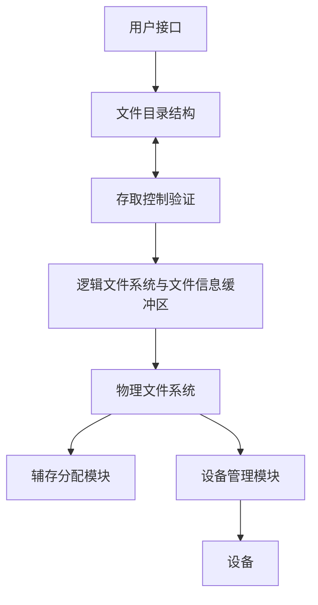

# 第十一章 文件系统

## 11.1 基本概念

内存具有易失性，需要文件系统管理信息

信息是计算机系统中的重要资源；

操作系统中的一个重要组成部分——文件系统，就负责**信息的组织、存储和访问**；

文件系统的功能就是**提供高效、快速和方便的信息存储和访问功能。**

> 文件系统是<mark>操作系统中以文件方式管理计算机软件资源的软件和被管理的文件和数据结构（如目录和索引表等）的集合。</mark>
>
> 从系统角度来看，文件系统是对文件存储器的存储空间进行组织、分配和回收，负责文件的存储、检索、共享和保护。
>
> 从用户角度来看，文件系统主要是实现“**按名取存**”，文件系统的用户只要知道所需文件的文件名，就可存取文件中的信息，而无需知道这些文件究竟存放在什么地方。  

### 文件系统的层次结构

### 文件系统的作用

> 提供对文件的各种操作，实现按名存取
>
> 提供合适的访问方式
>
> 提供目录管理和操作
>
> 实现文件的共享、保护
>
> 统一管理文件的存储空间，实现存储空间的分配和回收
>
> 实现逻辑文件与物理文件间的转换
>

### 文件概念

<mark>文件</mark>是记录在外存上的具有名字的相关信息的集合

#### 分类

> 系统文件、库文件、用户文件
>
> 临时文件、永久文件、档案文件
>
> 只读文件、读写文件、只执行文件
>
> 流式文件、记录式文件
>
> ......

#### 文件属性

文件名、类型、大小、位置、保护（读取、改写权限）、时间......

属性信息放在**目录**中存储在硬盘里

#### 文件系统结构

文件系统按层组织

文件控制块FCB：由一个文件的相关信息组成的存储结构

## 11.2 文件结构与存储设备

**用户和文件系统往往从不同的角度对待同一个文件 **

> 用户：从使用的角度，按信息的使用和处理方式组织文件。 
>
> 文件系统：从文件的存储和检索的角度，根据用户对文件的存取方式和存储介质的特性组织文件，决定用户文件存放在存储介质上的方式。 

**文件有两种形式的结构：文件的逻辑结构和文件的物理结构。**

> 逻辑结构:**用户对文件的组织结构**
>
> 物理结构:**文件在外存储器上的存储结构**
>
> 物理结构直接影响存储空间的使用和检索文件信息的速度
>
> 逻辑文件保存到存储介质上的工作由文件系统来做，这样可减轻用户的负担。根据用户对文件的存取方式和存储介质的特性，文件在存储介质上可以有多种组织形式。

### 文件的逻辑结构

文件从逻辑结构上分成二种形式，**一种是无结构的流式文件，另一种是有结构的记录式文件。**

> 流式文件是指对文件内信息不再划分单位，它是依次的一串字符流构成的文件。如exe文件
>
> 记录式文件是用户把文件内的信息按逻辑上独立的含义划分信息单位，每个单位称为一个逻辑记录（简称记录）。所有记录通常都是描述一个实体集的，有着相同或不同数目的数据项，记录的长度可分为定长和不定长记录两类。
>
> > 记录文件有**顺序、索引、索引顺序**文件几种。

**文件的结构由操作系统和程序决定**

#### 顺序结构文件

顺序文件的所有记录按键值的约定次序组织

记录可以是定长的，也可以是变长的，定长的便于查找

顺序文件常用于批量记录读取，对于访问某个记录的请求则处理性能不佳

#### 索引文件

索引文件对主文件中的记录按需要的数据项（一个或几个）建索引表。

为每个记录设置一个表项

索引文件本身是顺序文件组织，是一个定长文件。

**优点**：便于随机访问、易于文件增删

**缺点**：增加了空间开销，查找策略影响很大

#### 索引顺序文件

索引顺序文件是基于键的约定次序组织的。将顺序文件中的所有记录分为若干个组；再为顺序文件建立一张索引表，表中记录每个组的第一个记录，该索引项包含记录的键值和指向该记录的指针。它是顺序文件和索引文件的结合。

检索时，先根据关键字去检索索引表，找到该记录所在组的第一个记录的位置，然后再利用顺序查找法去查找主文件，找到所需记录

#### 文件的访问方式

常用的包括顺序存取、直接/随机存取

> 顺序访问：按照文件信息的逻辑顺序依次存取
>
> 随机存取：根据记录的编号来直接存取文件中的任意一个记录，而无需存取其前面的记录

### 文件的物理结构

用户按逻辑结构使用文件，文件系统按物理结构管理文件。因此，当用户请求读写文件时，文件系统<mark>必须实现文件的逻辑结构与物理结构之间的转换。</mark>

**文件在外存的存放组织形式**称为文件的物理结构

文件的物理结构**取决于外存的分配方式**

> - 连续分配——顺序结构
> - 链接分配——链接结构
> - 索引分配——索引结构

文件的存储设备主要有磁带，磁盘，光盘等，存储设备的特性可以决定文件的存取方法。

> 文件的存储设备常常划分为若干大小相等的**物理块**
>
> 以块为单位进行信息的存储、传输
>
> 磁带：顺序存取结构
>
> 磁盘：直接存取设备：三种文件物理结构都可以采用

#### 顺序分配

每一个文件占用一个连续的磁盘块的集合

简单：只需要起始块号和长度

可以随机存取、会**产生外碎片**

浪费空间：动态存储分配问题

从逻辑地址映射到物理地址：`逻辑地址/块大小=块号	逻辑地址%块大小=偏移`

**优点**：

> 简单,支持随机存取和顺序存取
>
> 顺序存取速度快
>
> **所需的磁盘寻道次数和寻道时间最少**

**缺点**：

> 要求连续的存储空间
>
> <mark>会产生外碎片</mark>
>
> 要求用户给出文件最大长度:不利于文件的动态扩充
>
> 不利于文件的插入和删除

#### 链接分配

**隐式链接**：一个文件的信息存放在若干不连续的物理块中，各块之间通过指针连接，前一个物理块指向下一个物理块

**不支持随机访问**、指针占据存储空间(所以除的时候要减去指针的空间)

不会产生外碎片

**优点**

> 提高了磁盘空间利用率,不存在外部碎片问题
>
> 有利于文件插入和删除
>
> 有利于文件动态扩充

**缺点**

> <mark>存取速度慢，不适于随机存取</mark>
>
> 可靠性问题，如指针出错
>
> 更多的寻道次数和寻道时间
>
> 指针占用空间

可将多个块组成簇，以簇为单位分配，指针占用百分比减少，但增加内碎片

变形得到**显式链接**：文件分配表FAT（整个磁盘只有一张）

#### 索引结构

> 链接结构没有外碎片，但不能直接存取
>
> FAT方式需要占用较大的内存空间
>

**事实上，打开某个文件时，只需知道该文件所在的盘块号**

一个文件的信息存放在若干不连续物理块中，系统为每个文件建立一个索引表，并将这些块的块号存放在索引表中

一个索引表就是磁盘块地址数组,其中第i个条目指向文件的第i块

**既没有外碎片，也可以随机访问**

**优点**:

> 保持链接结构的优点，又克服了其缺点:
>
> > 既能顺序存取又能随机存取
> >
> > 满足了文件动态增长\插入删除要求
> >
> > 能充分利用外存空间

**缺点**:

> **较多的寻道次数和寻道时间**
>
> 索引表本身带来了系统开销,如：内外存空间，存取时间

**索引表的组织**

> **链接模式**
>
> > :大的文件，索引表占了若干个盘块，一个盘块一个索引表,多个索引表链接起来
>
> **多级索引**
>
> > :o:将一个大文件的所有索引表（二级索引)的地址放在另一个索引表（主索引，一级索引)中
> > :o:在<mark>两级索引分配方式</mark>，若每个盘块大小为1KB，每个盘块号占4字节，则一个索引块中可存放256个盘块号。则两级索引最多可包含的盘块号总数为64K个（256\*256）。因此，所允许的文件的最大长度为64MB（64K*1KB）。
>
> **混合索引**
>
> 

## 11.3 目录结构

**目录**：一个包含着所有文件信息的节点的集合

目录结构和文件都在磁盘上

备份放在磁带

**目录中的信息**：名称、类型、地址、当前长度、最大长度、最后访问时间、数据最后更新时间、所有者ID、保护信息

:book: 文件**控制块FCB**

> 用于描述和控制文件的数据结构，它至少要包括文件名和存放文件的盘物理地址
>
> 文件控制块的有序集合称为文件目录，即一个文件控制块FCB就是一个文件目录项。

A FCB contains

> 文件基本信息：文件名，用户名，文件地址，文件长度，文件逻辑结构，物理结构
>
> 存取控制信息：文件存取权限
>
> 管理信息：共享计数，文件的建立日期，保存期限，最后修改日期，最后访问日期

### 文件目录与目录文件

:star: **文件目录：文件控制块的有序集合**

> 文件目录是用于检索文件的，它是文件系统实现按名存取的重要手段 ，它的组织和管理应便于检索和防止冲突 
>
> 目录项：构成文件目录的项目（目录项就是FCB）

:star: **目录文件：为了实现对文件目录的管理，将文件目录以文件的形式保存在外存，这个文件就叫目录文件**

> 目录结构的组织关系到:
>
> 文件的存取速度
>
> 文件共享性和安全性

### 目录操作

Operations Performed on Directory

建立、寻找、删除一个文件，列出目录的列表，重命名文件，遍历文件系统

### 组织目录的逻辑结构

Organize the Directory （Logically） to Obtain

两个用户可以有相同名字的不同文件、相同的文件可以有不同的名字

#### 单级目录Single-Level Directory

整个文件系统中，单级目录结构只建立一张目录表

**缺点**：不允许文件重名、文件查找速度慢

#### 二级目录Two-Level Directory

解决一级目录文件命名冲突，并提高对目录文件检索速度而改进

每个用户有单独的目录

目录分为两级：

> 一级称为主文件目录（MFD），给出用户名，用户子目录所在的物理位置；
>
> 二级称为用户文件目录（UFD，又称用户子目录），给出该用户所有文件的FCB

**优点**：

> 解决了文件的重名问题:用户名|文件名、查找时间降低

**缺点**

> 缺乏灵活性，不利于共享

 

#### 树型目录Tree-Structured Directories 

第一级目录为根目录、第二级目录为子目录、叶子节点为文件

**优点**：

> 层次结构清晰，便于管理和保护；
>
> 有利于文件分类；
>
> 解决重名问题；
>
> 提高文件检索速度；

**缺点**：

> 查找一个文件按路径名逐层检查，由于目录文件都放在外存，多次访盘影响速度

#### 无环图结构目录Acyclic-Graph Directories

有共享的子目录和文件

当用户要求删除一个共享节点时，系统不能简单地就删除，否则会导致其他用户访问时找不到，可以为每个共享节点设置一个共享计数器，每增加一个共享链时，计数器加一；每当有一个用户提出删除要求时，计数器减一，仅当计数器的值为0时，才真正删除结点。

#### 文件共享

##### 基于索引结点的共享方式——硬链接

两个不同的目录项只需要指向相同的索引结点即可实现共享

##### 利用符号链实现文件共享——软链接

系统为要共享文件的用户创建一个**link类型的新文件**，将这新文件登录在该用户共享目录项中，这个link型文件包含被链接文件的**路径名**。该类文件在用ls命令长列表显示时，文件类型为l。

拥有者才有指针、其他用户只有路径名

可以通过计算机网络链接到世界上任何地方的机器中的文件、其它用户读取符号链接的共享文件比读取硬连接的共享文件需要增多读盘操作

### 文件目录改进

为加快目录检索可采用目录项分解法：把FCB分成两部分

> •**符号文件目录**：
>
> ​     由文件名和文件内部标识组成的树状结构，
>
> ​     按文件名排序；
>
> • **基本文件目录**（索引节点目录）：
>
> ​     由其余文件说明信息组成的线性结构，
>
> ​     按文件内部标识排序。

## 11.4 文件操作

**建立文件**: 

> 建立文件的FCB
>
> 分配必要的外存空间
>
> 在文件目录中为之建立一个目录项,目录项中记录新文件的文件名及其在外存的地址等属性,返回一个文件描述符。

**删除文件**: 

> 从目录中找到要删除文件的目录项
>
> 使之成为空闲目录项
>
> 回收该文件所占用的存储空间

**读文件** : 把文件中的数据从外存读入内存的用户区

> 查找目录，找到指定文件的目录项，从中得到被读文件在外存的地址
>
> 从外存将数据读入内存

**写文件** : 

> 查找目录，找到指定文件的目录项
>
> 利用目录中的文件指针将信息写入文件

**打开文件**: 为了避免每次访问文件时都要从外存中查找文件目录，系统提供了打开文件命令。

> 将待访问文件的目录信息读入内存活动文件表中，建立起用户和文件的联系。
>
> 在有些系统中，也可以通过读命令隐含地向系统提出打开文件的要求。若在读写命令中不包含打开文件功能，则在使用文件之前，必须先打开文件。

**关闭文件**: 

> 撤消主存中有关该文件的目录信息，切断用户与该文件的联系；
>
> 若在文件打开期间，该文件作过某种修改，则应将其写回辅存。

## 11.5 文件存储空间管理Free-Space Management

**位图法**

> 用一串二进制位反映磁盘空间中分配使用情况, 每个物理块对应一位, **分配物理块为0，否则为1**。 申请物理块时，可以在位示图中查找为1的位，返回对应物理块号； 归还时；将对应位置1。
>
> 位图的大小由磁盘空间的大小缺点，保存在主存中

**空闲块表** 

> 将所有空闲块记录在一个表中，即空闲块表，有两项：该空闲区的第一个盘块号、该区的空闲盘块总数

**空闲块链表**

> 把所有空闲块链成一个链. 扩展：成组链接法

**成组链接法**

## 11.6 文件系统实现

文件系统的实现需要数据结构的支持：磁盘中的结构和内存中的结构

磁盘中的结构：引导控制块、分区控制块、目录结构FCB

